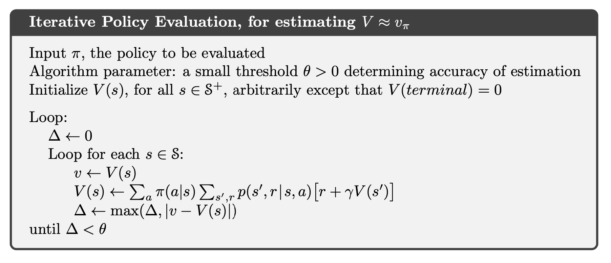
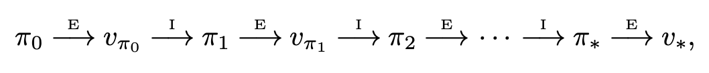

# **Dynamic Programming**

- We usually assume that the **environment is a finite MDP**. That is, we assume that its state, action, and reward sets, S, A, and R, are finite, and that its dynamics are given by a set of probabilities $p(s',r|s,a)$
- **DynProg** showed us that with a model of the **environment’s transition dynamics**, i.e., $p(s', r|s, a)$, we can solve the **prediction problem** via calculation to obtain $v_{\pi}$ and/or $q_{\pi}$ given $\pi(a|s)$. With the value functions, obtained above, we have the means to improve policy $\pi$: we can adjust policy $\pi$ such that:
    - (**via** $v_{\pi}$) for every state, $s$, modified policy $\pi'$ acts so $E$ evolves to state $s' = \arg\max_{s}(v_{\pi}(s))$, i.e., the state with the maximum value (note: in order to derive the action that allows this, **the agent will require** $p$)
    - (**via** $q_{\pi}$) for every state, $s$, modified policy $\pi'$ selects action $a=\arg\max_{a}q_{\pi}(s,a)$
- **Policy Evaluation (Prediction)**

    

    Start by choosing arbitrarily v0 and keep update the Bellman equation until we reach the fixed point so that v == V(s).

- **Policy evaluation (Eval)** (also called prediction): given a policy, $\pi$, obtain the associated value function (i.e., $v_{\pi}$ or $q_{\pi}(s,a)$)

- **Policy Improvement**
    
    $$
    \begin{align}
    \pi'(s)&\doteq \argmax_{a}q_{\pi}(s,a) \\
    &= \argmax_{a} \mathbb{E}[R_{t+1}+\gamma v_{\pi}(S_{t+1})|S_{t}=s, A_{t}=a] \\
    &= \argmax_{a}\sum_{s',r}p(s',r|s,a)[r+\gamma v_{\pi}(s')] \\
    \end{align}
    $$
    
    Selecting at each state the action that appears best according to $q_{\pi}(s,a)$ to make the new policy improves on original policy.
    
    **Policy improvement (Impr)**: given a policy, $\pi_{k}$, synthesize an improved policy, $\pi_{k+1}$, whose value function exceeds that of the $k$-th policy
    
- **Policy Iteration**
    

    

    Do policy evaluation first using current policy $\pi_{k}$, then we can have the state-value function $V_{\pi_{k}}(s)$ based on $\pi_{k}$ which contains expected return for each state. After that we will do policy improvement based on the current state-value function $V_{\pi_{k}}(s)$.  We will pick the action that max the $q_{\pi_{k}}(s,a)$ in state s and update our current policy. The policy Iteration will stop when the policy is stable.

- **Value Iteration**
    
    $$
    \begin{align}
    v_{k+1}(s)&\doteq \max_{a} \mathbb{E}[R_{t+1}+\gamma v_{k}(S_{t+1})|S_{t}=s, A_{t}=a] \\
    &= \max_{a}\sum_{s',r}p(s',r|s,a)[r+\gamma v_{k}(s')] \\
    \end{align}
    $$
    
    

    
    Instead of doing policy evaluation and obtaining state-value function $V_{\pi_{k}}(s)$, we directly find the action a that maximizes the state-value function under state s. Then get the policy based on the stable state-value function.
    
- **What is Generalized policy iteration (GPI)?**

    Although DP model allows one to compute the optimal policy, $\pi_{*}$, this **computation can be intractable** for large problems. Instead, we consider iterative approaches to solve for the optimal policy. **Generalized policy iteration (GPI)** can be referred to the general idea of letting policy-evaluation and policy-improvement processes interact. If both the evaluation process and the improvement process stabilize, that is, no longer produce changes, then the value function and policy must be optimal.
- **Why that Eval_Trunc could be used in place of Eval is important for Dynamic Programming?**

    Policy Iteration interleaves Eval and Impr; however, the Eval step is itself an asymptotic process that requires iteration (n → ∞) to get to vpi or qpi. Eval- Trunc is a practical alternative that allows the use of an approximation Vpi or Qpi, which can be computed in T < ∞.
- **Why that Eval_Trunc could be used in place of Eval is important for Reinforcement Learning?**

    This is vital to RL because it enables the use of any process in which the approximate V or Q is computed, e.g., Monte Carlo sampling.
- **Why we still need value iteration or EvalTrunc?**
    
    One major issue is **time complexity**: Eval is an asymptotic inner iteration of an asymptotic outer iteration (GPI). Of major significance is **value iteration**: the replacement of Eval by **truncated evaluation** (**EvalTrunc**) enabling us to profitably use approximations of the value functions in GPI.
    
    We note that the iterative sub-process for Eval, which converges to $v_{\pi}$ (or $q_{\pi}$) asympototically, **can be truncated** (i.e. to the approximations $V_{\pi}$ (or $Q_{\pi}$)
    
    DynProg’s value iteration — i.e., the relaxation of the need for $v_{\pi}$ , in favor of the approximation $V_{\pi}$ — leads us to Monte Carlo where, **instead of exploiting $p$ to calculate the value functions, we sample the environmental rewards to estimate the return**, and thereby the value functions.
    
- **Eval Step and expected reward approximation in DP, MC, and TD?**
    - With **DynProg Eval**, in order to obtain $v_{\pi}$, we approximated $v_{\pi}(S_{t+1})$ on the RHS via the use of $V_{\pi}(S_{t+1})$ (i.e., the contents of the tabular data structure that was being iterated); we called this **bootstrapping**.
    - With **MC Eval** we approximated the expected return with sample averages of the rewards
    - With **TD(0)**, we approximate the expected reward with a sampling of the reward and we bootstrap by employing the approximation $V_{\pi}(S_{t+1})$.
- **Why Bellman equation is important for Dynamic Programming?**

    The Bellman equations define a relation that the optimal v∗ or q∗ must obey. This enables the use of an iterative process to compute the v or q; the fixed point of this dynamic process will necessarily satisfy the Bellman equations.
    - $v_{k+1}(s) =\sum_{a}\pi(a|s)\sum_{s',r}p(s',r|s,a)[r+\gamma v_{k}(s')]$
    - $q_{k+1}(s,a)= \sum_{s',r}p(s',r|s,a)[r+\gamma \sum_{a'}\pi(a'|s')q_{k}(s',a')]$
