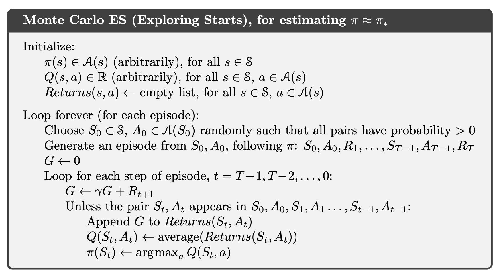
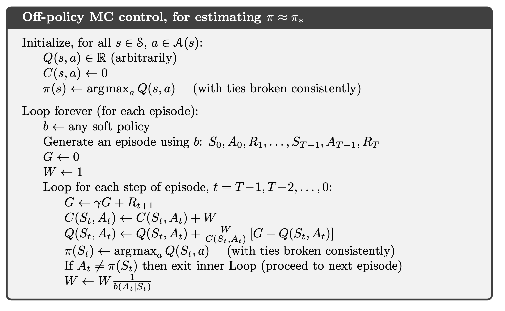

# **Monte Carlo Methods**

- We do **not** assume complete knowledge of the **environment**. Monte Carlo methods require only **experience.** We assume experience is divided into **episodes**, and that all episodes eventually terminate no matter what actions are selected.
- **MDP formulation with Bellman equation** allows us to calculate the optimal policy, $\pi_{*}$.
- We formulated an iterative process (**GPI**) for which the optimal policy is a fixed point.
- Instead of the asymptotic **Eval** that yields $v_{\pi}$, we settled on a practical truncation, **EvalTrunc**, that gives us the approximation $V_{\pi}$ and demonstrated that GPI still works. This means we can employ Monte Carlo to approximating the value function via **sampling and averaging rewards to estimate the returns**.

    We only require that the environment obey the Markov property (i.e., it is state determined); we don’t requite the model itself.

    Monte Carlo demands sampling in favor of analytic calculations; this requires **data** (i.e., **rewards**) and hence **experience.** Monte Carlo demands **effective sampling**, which pose **stochastic** requirements on our action selection

- **Explain how exploration concretely manifests itself in Reinforcement Learning as presented for Dynamic Programming and Monte Carlo methods.**
    - Exploration does not manifest itself in Dynamic Programming since DynProg is a calculation technique that exploits a model of the environment (p); it does not require sampling of the environment directly (and hence does not need exploration to ensure full sampling of the SxA domain of Q, or the S domain of V).
    - Exploration manifests itself in MC via the need to adequately sample the SxA domain space of Q; this is needed to ensure the Q table is as complete as possible (which in turn ensures that improvement is done with adequate information). Exploring starts is possible in simulated environments, in which we can “explore” the SxA space of the simulated environment. For real environments which can not be simulated, exploration is demanded of the policy to ensure GPI produces high-quality approximations of the value functions.
- **Why is exploration needed?**

    Exploration is needed to ensure that the domain of the value function is fully sampled; this will ensure that the approximate value function is as complete as possible.
- **First Visit Monte Carlo Prediction**
    
    

    
    Given a policy $\pi$, we initial a state-value function $V(s)$ and a return. In the loop, we firstly generate an episode based on $\pi$. We loop back based on the episode we just generated and record the return G, stop until we find $S_{t}$. Then append the G to the return list and set the $V(s)$ to the average of the return list.
    
- **Why we use action values rather than state values in MC? (focus on $Q$ not on $V$)**

    With a model, state values alone are sufficient to determine a policy; one simply looks ahead one step and chooses whichever action leads to the best combination of reward and next state. Without a model, however, state values alone are not sufficient. One must explicitly estimate the value of each action in order for the values to be useful in suggesting a policy. Thus, one of our primary goals for Monte Carlo methods is to estimate $q_{*}$.
- **Explain the two approaches for GPI with on-policy MC.**

    The two main on-policy MC approaches are GPI with exploring starts and GPI with an epsilon greedy policy. The former ensures we sample the action value function by explicitly ensuring we have episodes that adequately cover the entire state-action space. The latter obtains achieves this adequate sampling by using a stochastic policy which will, in the limit as iterations approach infinity, cover the entire state-action space.
- **Problem: Some state-action pair may never be visited in MC? (Maintaining Exploration)**

    - **Option 1 (exploring starts):** specifying that the episodes start in a state–action pair, and that every pair has a nonzero probability of being selected as the start.
        
        When learning directly from actual interaction with an environment, it will **not** work well. It is practical, generally, only when we have access to a **simulator** that we can start at any arbitrary state-action pair
        
        The exploration does not happen after the initial step.
        
    - **Option 2 (stochastic policy):** We demand that our policy be stochastic and that $\forall s$, $\pi(a|s)>0$: we thus see the need for exploration.
- **If we have a simulated environment, which method should we choose?**

    Exploring starts is more appropriate for a simulated environment since it is possible to configure the environment in arbitrary state-action configurations, meaning it is easier to guarantee that we start at any configuration. Further- more, GPI with an epsilon greedy policy will only yield an optimal policy among the space of all epsilon-greedy policies whereas GPI with exploring starts will always yield the optimal policy.
- **Monte Carlo Control**

    

- **Two assumptions of MC Methods?**

    We made two unlikely assumptions to obtain this guarantee of convergence for the Monte Carlo method. One was that the episodes have **exploring starts**, and the other was that **policy evaluation could be done with an infinite number of episodes**.
- To remove the assumption that policy evaluation operates on an **infinite number of episodes**.
    1. Hold firm to the idea of approximating $q_{\pi_{k}}$ in each policy evaluation. (require far too many episodes to be useful in practice on any but the smallest problem)
    2. Give up trying to complete policy evaluation before returning to policy improvement (Value Iteration)

    

    Initial policy $\pi$, action-value $Q(s,a)$ and return. For each loop, randomly select select the initial state-action pair so that all pairs have change to be selected. Then generate an episode and loop back from t = T-1. Record the reward to return and set the $Q(s,a)$ to the average of the returns. Find the action that maximizes the $Q(s,a)$ and update $\pi$.

- To avoid the unlikely assumption of exploring starts: **on-policy method**s and **off-policy methods**. **On-policy** methods attempt to evaluate or improve the policy that is used to make decisions, whereas off-policy methods evaluate or improve a policy different from that used to generate the data.
- **soft policy: $\pi(a|s) > 0$** for all $s \in S$ and all $a \in A(s)$. But gradually shifted closer and closer to a deterministic optimal policy.
- **$\epsilon$ -soft policy:** policies for which $\pi(a|s) \geq \frac{\epsilon}{|A(s)|}$  for all states and actions. (small $\epsilon >0$)
- **$\epsilon$ -greedy policy:** Most of the time they choose an action that has maximal estimated action value, but with probability $\epsilon$ they instead select an action at random. (**the greedy policies to have equal probabilities and the non-greedy policies to also have the rest of the probability mass**)
    
    Any epsilon greedy policy is guaranteed to be an epsilon soft one since it implicitly enforces every probability to be at least $\frac{\epsilon}{|A(s)|}$. But an epsilon soft policy is not guaranteed to be a epsilon greedy policy.
    
- **What differentiates e-soft and e-greedy action selection policies?**
    
    An epsilon soft policy only requires π(a|s) ≥ ε , a ∈ A(s) whereas an epsilon |A(s)| greedy policy requires the greedy policies to have equal probabilities and the nongreedy policies to also have the rest of the probability mass (each equal as well). Any epsilon greedy policy is guaranteed to be an epsilon soft one since it implicitly enforces every probability to be at least ε anyway. However, the |A(s)| other way around is not always true (e.g., part c).
    
- **On-policy first-visit MC Control**
    
    

    
    Different from the exploring start, on-policy method directly generate episodes and pick the action that maximizes the $Q(s,a)$. To update the $\pi(S_{t})$, we use epsilon greedy.
    
    The on-policy approach in the preceding section is actually a compromise—it learns action values not for the optimal policy, but for a near-optimal policy that still explores.
    
- **Why we need an off-policy method? (Conflict)** 

    There is a fundamental conflict between Eval and GPI that we need to address. The goal of Eval is to estimate Q; Impr can then use Q to synthesize a better policy. The goal of GPI is to obtain the optimal policy, and to that end it interleaves Eval and Impr. However, an optimal policy must be fanatical in taking the best action; an effective Eval process must sample the domain space of Q adequately — this includes taking potential sub-optimal exploratory actions. It is not possible to interleave a process (Eval) that demands exploratory, diverse action selection policies, in a process whose goal it is to obtain a fanatically-optimal policy.
    
    The conflict can be resolved with off policy methods where the behavior- generating policy (b) is distinct from the agent control policy (π) that GPI is improving. We can then evaluate policy b (which will possible since b will be a policy that covers π, but is also sufficiently-diverse; e.g., it can be an ε-soft version of π) to obtain the value function of b. Via **importance sampling** we can convert the value function of b into one for π, enabling Impr for π.
    
- **Off-policy learning:** use two policies, one that is learned about and that becomes the optimal policy, and one that is more exploratory and is used to generate behavior. The policy being learned about is called the **target policy ($\pi$)**, and the policy used to generate behavior is called the **behavior policy ($b$)**.
    
    

    
- **How does off-policy works in MC prediction?**
    
    The outer loop starts with a policy b that covers policy π; recall, any ε-soft version of π will suffice (e.g., an ε-greedy πε). An episode is generated, and the initial return G is set to 0, and the initial importance sampling weight is set to W. We then compute the incremental return by working backwards in time; this makes the discounted-future return computation straightforward.
    

    

    The key difference here is that as the prediction process runs (the inner loop’s Q update, per the above discussion), the **policy π** is also being updated. The **algorithm updates the policy immediately** upon obtaining an updated estimate of Q.

- **How are we able to estimate Q_pi using b as the episode-generating policy?**

    Importance sampling allows us to scale the returns calculated from the rewards observed by following policy b. This allows us to approximate Q for the target policy π.
- **Why the prediction algorithm processes backwards? And what is the problem in off-policy control?**
    
    This introduces a **problem**: as we move backwards in time to process the episode (recall we earlier argued that the prediction algorithm processes backwards because it **enables the** **simple form of the incremental discounted return formula**) we run into the possibility that our **episode trace conflicts with the optimized policy**. Hence, we must do a check to confirm that the action is consistent with the updated greedy policy update. If it is: we can continue to use the episode to update Q. If it is not: we must break out of the loop, and regenerate a new episode.
    
- **Is there any ways to make an equivalent inner loop with a forward-time order?**

    There is no way to make an equivalent inner loop with a forward-time order due to the possibility of exiting the loop if an observed action is ever different from the updated target policy action at the current time step. Therefore, the expected return may not be fully computed up until termination, meaning its estimate can be quite poor.
- **Why we compute the return using reversed time indices?**

    If we processed the episode from the start and noticed an inconsistency, we would have to throw the estimated return, since we would not be able to get to the final reward RT. Processing backwards, our incremental return is always a valid estimate since it ends with the final return RT
- **In computing the returns, why does the iteration process episodes in reverse-time order?**

    Processing the episode in reverse-time ensures we run the computation to the terminal state. This enables the simple computation of G using its recurrence relation.
