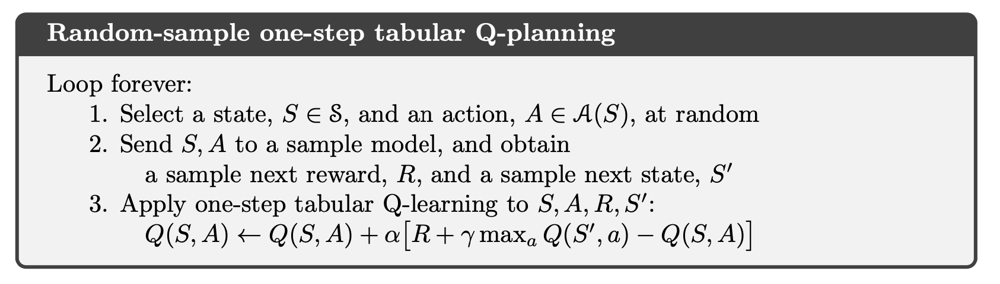
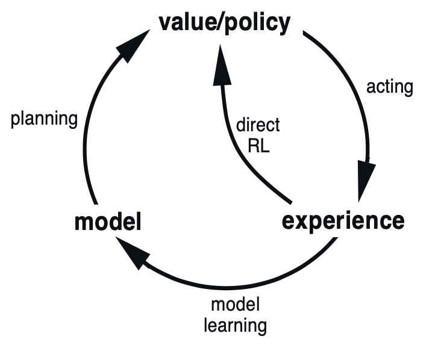
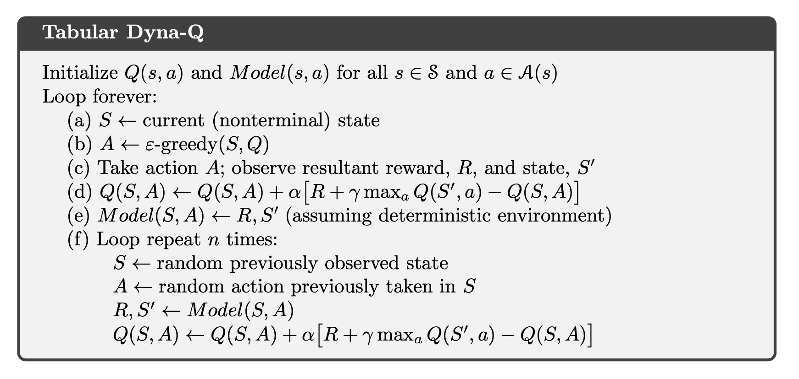
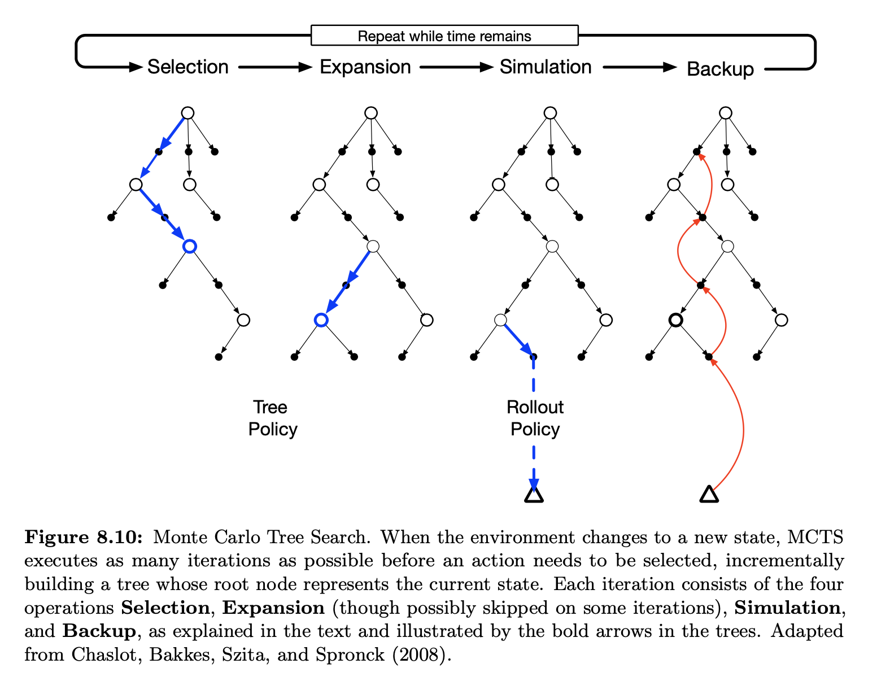

# **Planning**

By a model of the environment we mean anything that an agent can use to predict how the environment will respond to its actions. Given a state and an action, a model produces a prediction of the resultant next state and next reward. If the model is stochastic, then there are several possible next states and next rewards, each with some probability of occurring. Some models produce a description of all possibilities and their probabilities; these we call **distribution models**. Other models produce just one of the possibilities, sampled according to the probabilities; these we call **sample models**. **Distribution models are stronger** than sample models in that they can always be used to produce samples. However, in many applications it is much **easier to obtain sample models** than distribution models.

We say the model is used to simulate the environment and produce simulated experience. The word **planning** is used in several different ways in different fields. We use the term to refer to any computational process that **takes a model as input** and produces or **improves a policy** for interacting with the modeled environment:

There are two basic ideas: (1) all state-space planning methods involve **computing value functions** as a key intermediate step toward improving the policy, and (2) they compute value functions by updates or backup operations applied to **simulated experience**. This common structure can be diagrammed as follows:

The heart of both **learning** and **planning** methods is the estimation of value functions by backing-up update operations. The difference is that whereas planning uses **simulated experience** generated by a model, learning methods use **real experience** generated by the environment.

**The benefits of planning** in small, incremental steps. This enables planning to be **interrupted or redirected at any time** with little wasted computation, which appears to be a key requirement for efficiently intermixing planning with acting and with learning of the model. Planning in very small steps may be the most efficient approach even on pure planning problems if the **problem is too large** to be solved exactly.

Within a planning agent, there are at least two roles for **real experience**: it can be used to **improve the model** (to make it more accurately match the real environment) and it can be used to **directly improve the value function** and policy using the kinds of reinforcement learning methods. The former we call **model-learning**, and the latter we call **direct reinforcement learning** (direct RL).

Both direct and indirect methods have **advantages** and **disadvantages**. Indirect methods often make fuller use of a limited amount of experience and thus achieve a better policy with fewer environmental interactions. On the other hand, direct methods are much **simpler** and are **not affected by biases** in the design of the model.

- **MC Tree Search**
    
    

