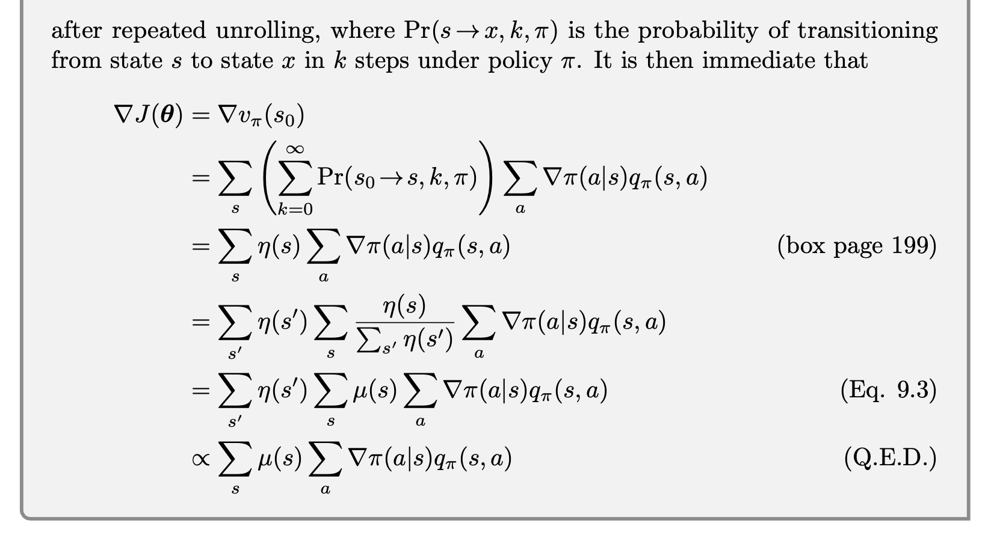

# **Policy Gradient**

We consider methods that instead **learn a parameterized policy** that can **select actions without consulting a value function**. A value function may still be used to learn the policy parameter, but is not required for action selection. We write $\pi(a|s,\theta)=Pr\{A_{t}=a|S_{t}=s,\theta_{t}=\theta\}$ for the probability that action $a$ is taken at time $t$ given that the environment is in state $s$ at time $t$ with parameter $\theta$.

The idea behind policy gradient methods is simple at a high level: we represent the policy as a tunable function, and tune the parameters of the policy to optimize some metric, such that the resulting tuned policy exhibits the requisite competance (performance). We will use gradient traversal methods, and hence the gradient of the function approximation for the policy — the policy gradient — is the object of interest, as it is the basis for policy function tuning.

we consider methods for learning the policy parameter based on the gradient of some scalar performance measure $J(\theta)$ with respect to the policy parameter. These methods seek to maximize performance, so their updates approximate gradient ascent in $J$:

$$
\theta_{t+1}= \theta_{t}+\alpha\nabla\hat{J}(\theta_{t})
$$

Where $\nabla\hat{J}(\theta_{t})$ is a stochastic estimate whose expectation approximates the gradient of the performance measure with respect to its argument $\theta_{t}$. All methods that follow this general schema we call **policy gradient methods**, whether or not they also learn an approximate value function.

In policy gradient methods, the policy can be parameterized in any way, as long as $\pi(a|s,\theta)$ is differentiable with respect to its parameters. If the action space is **discrete and not too large**, then a natural and common kind of parameterization is to form parameterized numerical preferences $h(s,a,\theta)$ for each state–action pair. The actions with the highest preferences in each state are given the highest probabilities of being selected, for example, according to an exponential soft-max distribution:

$$
\pi(a|s,\theta)=\frac{e^{h(s,a,\theta)}}{\sum_{b}e^{h(s,b,\theta)}}
$$

We call this kind of policy parameterization **soft-max in action preferences**.

- Soft-max converts a set of discrete values into a soft metric in $(0, 1)$. This soft metric has similar properties to a stochastic value function, which has **ideal characteristics** including:
    - it admits stochastic action selection to facilitate exploration
    - it enables the realization of stochastic action selection where warrented
    - action selection probabilities vary smoothly with the function parameter (versus the hard selection from ε-greedy action selection)
- **Practical Advantage of parameterizing policies**
    - One advantage of parameterizing policies according to the soft-max in action preferences is that the approximate policy can approach a deterministic policy.
    - A second advantage of parameterizing policies according to the soft-max in action preferences is that it enables the selection of actions with arbitrary probabilities.
    - Perhaps the simplest advantage that policy parameterization may have over action- value parameterization is that the policy may be a simpler function to approximate.
    - We note that the choice of policy parameterization is sometimes a good way of injecting prior knowledge about the desired form of the policy into the reinforcement learning system.
- **Theoretical Advantage of parameterizing policies**

    With continuous policy parameterization the action probabilities change smoothly as a function of the learned parameter, whereas in "$\epsilon$-greedy selection the action probabilities may change dramatically for an arbitrarily small change in the estimated action values. Largely because of this, **stronger convergence guarantees** are available for policy-gradient methods than for action-value methods.
- We simplify the notation without losing any meaningful generality by assuming that every episode starts in some particular (non-random) state $s_{0}$. Then, in the episodic case we define performance as
    
    $$
    J(\theta)=v_{\pi_{\theta}}(s_{0})
    $$
    
    where $v_{\pi_{\theta}}$ is the true value function for $\pi_{\theta}$, the policy determined by $\theta$.
    
- **How can we estimate the performance gradient with respect to the policy parameter when the gradient depends on the unknown effect of policy changes on the state distribution?**

    There is an excellent theoretical answer to this challenge in the form of the **policy gradient theorem**, which provides an analytic expression for the gradient of performance with respect to the policy parameter that does not involve the derivative of the state distribution. The policy gradient theorem for the episodic case establishes that
    
    $$
    \nabla J(\theta)\propto \sum_{s}\mu(s)\sum_{a}q_{\pi}(s,a)\nabla \pi(a|s,\theta)
    $$
    
    

    

    
    
- **REINFORCE: Monte Carlo Policy Gradient**

    The policy gradient theorem gives an exact expression proportional to the gradient; all that is needed is some way of sampling whose expectation equals or approximates this expression. Notice that the right-hand side of the policy gradient theorem is a sum over states weighted by how often the states occur under the target policy $\pi$; if $\pi$ is followed, then states will be encountered in these proportions. Thus
    
    $$
    \nabla J(\theta)\propto \sum_{s}\mu(s)\sum_{a}q_{\pi}(s,a)\nabla \pi(a|s,\theta) \\
    =E_{\pi}[\sum_{a}q_{\pi}(S_{t},a)\nabla\pi(a|S_{t},\theta)]
    $$
    
    We could stop here and instantiate our stochastic gradient-ascent algorithm as
    
    $$
    \theta_{t+1}=\theta_{t}+\alpha\sum_{a}\hat{q}(S_{t},a,w)\nabla\pi(a|S_{t},\theta)
    $$
    
    We then replace a sum over the random variable’s possible values by an expectation under $\pi$, and then sampling the expectation. We introduce a **weighting**, without changing the equality, by multiplying and then dividing the summed terms by $\pi(a|S_{t},\theta)$. We have,
    
    

    
    The final expression in brackets is exactly what is needed, a quantity that can be sampled on each time step whose expectation is proportional to the gradient. Using this sample to instantiate our generic stochastic gradient ascent algorithm yields the REINFORCE update:
    
    $$
    \theta_{t+1}= \theta_{t}+\alpha G_{t}\frac{\nabla\pi(A_{t}|S_{t},\theta_{t})}{\pi(A_{t}|S_{t},\theta_{t})}
    $$
    
    Note that REINFORCE uses the complete return from time $t$, which includes all future rewards up until the end of the episode. In this sense REINFORCE is a **Monte Carlo algorithm** and is well defined only for the episodic case with all updates made in retrospect after the episode is completed.
    
    

