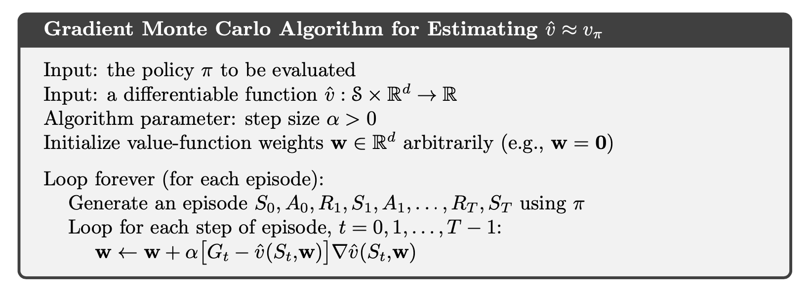
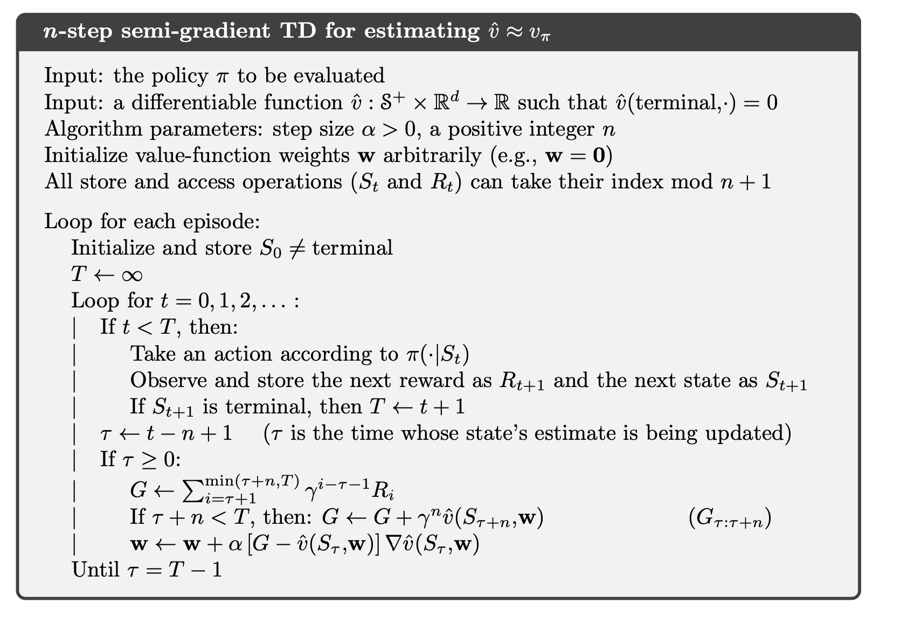
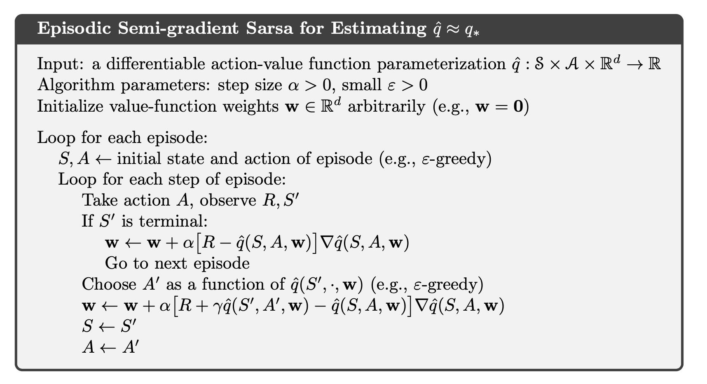
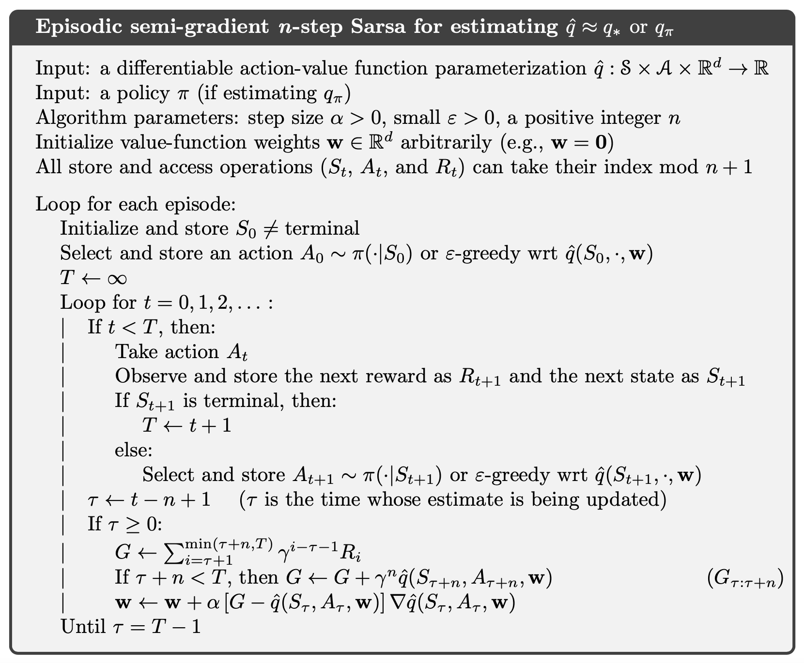

# **Prediction and Control with Function Approximation**

- We begin our study of function approximation in reinforcement learning by considering its use in estimating the state-value function from on-policy data, that is, in **approximating $v_{\pi}$ from** experience generated using a known policy $\pi$. We will write $\hat{v}(s,w) \approx v_{\pi}(s)$ for the approximate value of state s given weight vector $w$. For example, $\hat{v}$ might be a **linear function** in features of the state, with $w$ the vector of feature weights. More generally, $\hat{v}$ might be the function computed by a **multi-layer artificial neural network**, with $w$ the vector of connection weights in all the layers.
    
    $$
    w_{t+1} = w_{t}-\frac{1}{2}\alpha\nabla[v_{\pi}(S_{t})-\hat{v}(S_{t},w_{t})]^{2}\\ = w_{t}+\alpha\nabla[v_{\pi}(S_{t})-\hat{v}(S_{t},w_{t})]\nabla\hat{v}(S_{t},w_{t})
    $$
    

    **Note**: Remember our essential goal is to **replace the tabular data structure** with a more scalable alternative. Our goal now is to also approximate $v_{\pi}$ or $q_{\pi}$ , as $\hat{v}$ or $\hat{q}$ using function approximation techniques.

    **Problem:** We need a dataset! Specifically, in order to use the gradient descent-based supervised learning methods presented prior, we require sample input/output (data/target) tuples from $v_{\pi}$ or $q_{\pi}$.

- **Error Function**

    Per our prior development, the per-prediction error is:
    
    $$
    PE(s) = \frac{1}{2}(\hat{v}(s)-v_{ref}(s))^{2}
    $$
    
    where, **ideally, $v_{ref}(s)=v_{\pi}(s)$**. Aggregating this over all states:
    
    $$
    E = \frac{1}{N}\sum_{\forall s\in S}PE_{i}(s)
    $$
    
    To this standard development, the textbook introduces a **per-state weighting function** $\mu(s)$ such that:
    
    $$
    \sum_{\forall s}\mu(s) = 1
    $$
    
    which serves to bias the tuning in favor of certain states (as per the distribution of $\mu(s)$; if $\mu(s)$ is identical for all states, then the development is essentially identical to the standard development.) It then defines the **aggregate of the weighted per-prediction errors** as:
    
    $$
    \bar{VE}=\frac{1}{N}\sum_{s\in S}\mu(s)PE(s)
    $$
    
    $\bar{VE}$ **is used in place of $E$ for gradient descent.**
    
- **Reference**

    Setting $v_{ref}$ depends on whether we are using MC methods or TD ones. Al- though TD subsumes MC, there is a **key difference**: MC methods involve **no bootstrapping**, while TD does.
    - We perform **MC**, as usual, and compute our estimate of the reference by processing episodic content to arrive at $G_{t}$. This becomes the reference sample that will be used for $v_{ref}$ . We continue to stochastically sample returns, and apply this to the training process as our $v_{ref}$ yielding the update law:
        
        $$
        w \leftarrow w - \alpha[\hat{v}_{w}(S_{t})-G_{t}]\nabla_{w}\hat{v}_{w}(S_{t})
        $$
        
        

        
    - With **TD(0)**, approximate the reference as $R_{t} + \gamma V (S_{t+1})$. This involves **bootstrapping**, and it happens to **bias** the reference. For this reason, this is called a **semi-gradient** technique. The update law is as expected:
        
        $$
        w \leftarrow w - \alpha[\hat{v}_{w}(S_{t})-(R_{t} + \gamma V (S_{t+1}))]\nabla_{w}\hat{v}_{w}(S_{t})
        $$
        
        

        

        
        - **Why TD method involves bootstrapping, and it happens to bias the reference?**

            Bootstrapping targets such as n-step returns or the DP target all depend on the current value of the weight vector $w_{t}$, which implies that they will be **biased** and that they will not produce a true gradient-descent method. Bootstrapping methods are not in fact instances of true gradient descent. They take into account the effect of changing the weight vector $w_{t}$ on the estimate, but ignore its effect on the target. They include only a part of the gradient and, accordingly, we call them **semi-gradient methods**.
        - **Why we still need semi-gradient methods?**

            They do converge reliably in important cases. They typically enable significantly faster learning. They enable learning to be **continual and online**, without waiting for the end of an episode.
- **Episodic Semi-gradient Control**
    - The general gradient-descent update for action-value ****prediction is:
        
        $$
        w_{t+1} = w_{t}+\alpha[U_{t}-\hat{q}(S_{t},A_{t},w_{t})]\nabla\hat{q}(S_{t},A_{t},w_{t})
        $$
        
    - For example, the update for the **one-step Sarsa** method is
        
        $$
        w_{t+1} = w_{t}+\alpha[R_{t+1}+\gamma \hat{q}(S_{t+1},A_{t+1},w_{t})-\hat{q}(S_{t},A_{t},w_{t})]\nabla\hat{q}(S_{t},A_{t},w_{t})
        $$
        
        We call this method **episodic semi-gradient one-step Sarsa**.
        
        

        
- **Semi-gradient n-step Sarsa**

    We can obtain an n-step version of episodic semi-gradient Sarsa by using an n-step return as the update target in the semi-gradient Sarsa update equation. The n-step return immediately generalizes from its tabular form to a function approximation form. The **n-step update equation** is
    
    $$
    w_{t+n} = w_{t+n-1}+\alpha[G_{t:t+n}-\hat{q}(S_{t},A_{t},w_{t+n-1})]\nabla\hat{q}(S_{t},A_{t},w_{t+n-1})
    $$
    
    

