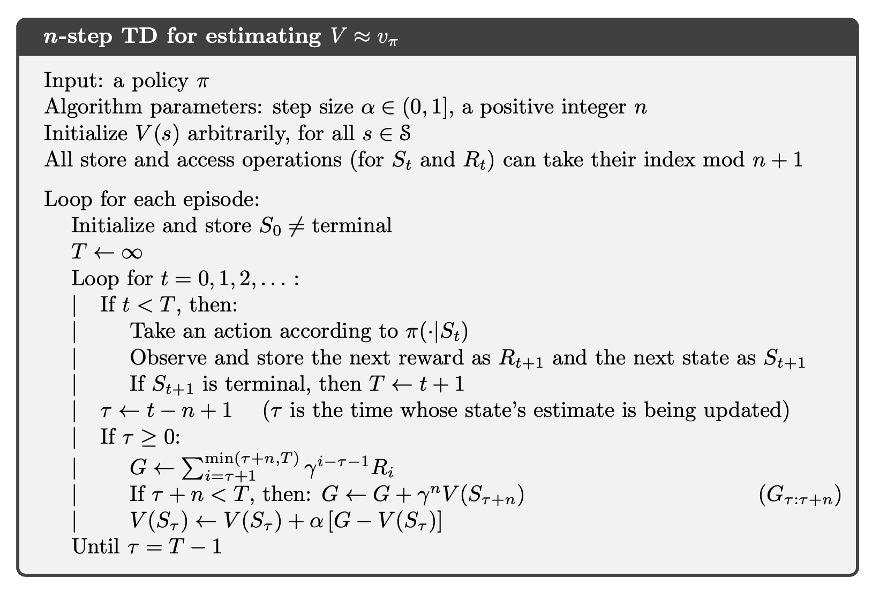
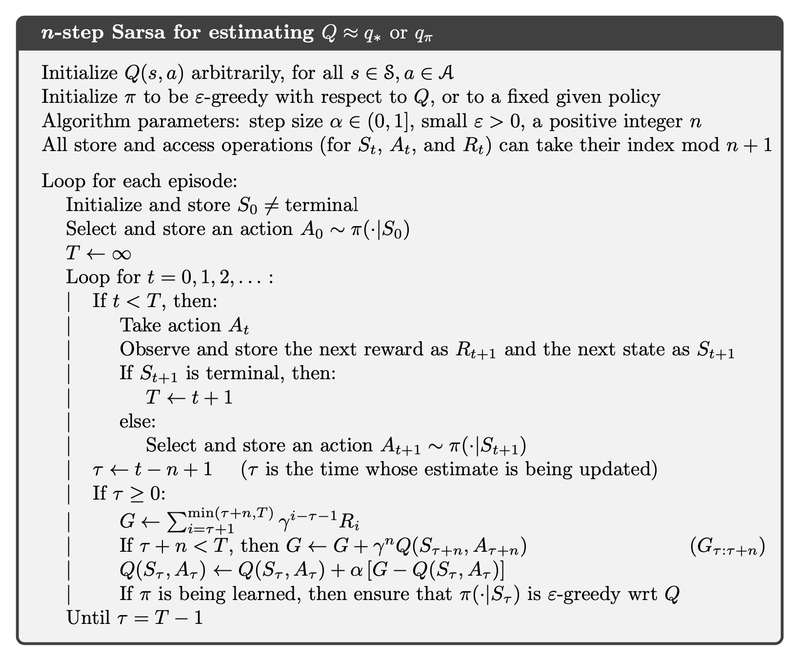
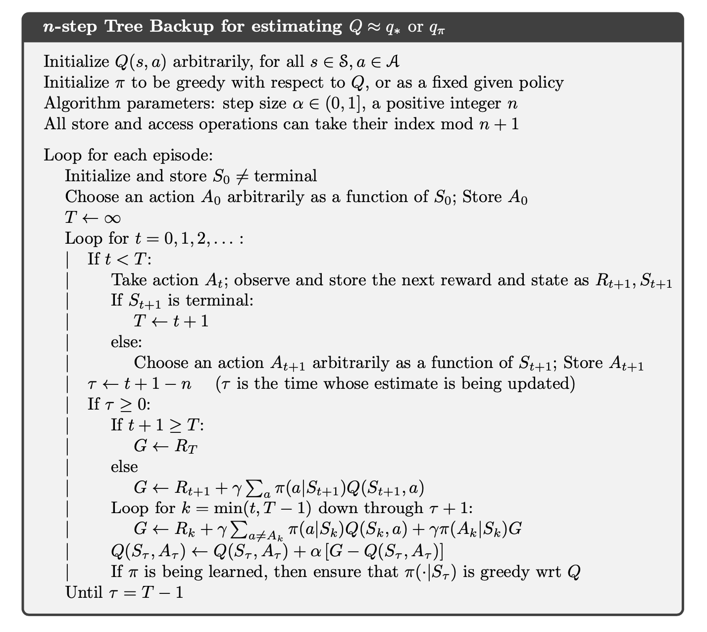

# **TD(n)**

- **n-step TD Prediction**
    
    For **MC method**:
    
    $$
    G_{t}=R_{t+1}+\gamma R_{t+2}+ \gamma^{2} R_{t+3}+ \dots + \gamma^{T-t-1} R_{T}
    $$
    
    For **One-step Return**:
    
    $$
    G_{t:t+1}=R_{t+1}+\gamma V_{t}(S_{t+1})
    $$
    
    For **Two-step Return**:
    
    $$
    G_{t:t+2}=R_{t+1}+\gamma R_{t+2}+\gamma^{2} V_{t+1}(S_{t+2})
    $$
    
    For **One-step Return**:
    
    $$
    G_{t:t+n}=R_{t+1}+\gamma R_{t+2}+\dots +\gamma^{n-1}R_{t+n}+\gamma^{n} V_{t+n-1}(S_{t+n})
    $$
    
    

    
- **n-step SARSA**
    
    $$
    G_{t:t+n}=R_{t+1}+\gamma R_{t+2}+\dots +\gamma^{n-1}R_{t+n}+\gamma^{n} Q_{t+n-1}(S_{t+n},A_{t+n})
    $$
    
    $$
    Q_{t+n}(S_{t},A_{t})=Q_{t+n-1}(S_{t},A_{t})+\alpha[G_{t:t+n}-Q_{t+n-1}(S_{t},A_{t})]
    $$
    
    

    
    **Expected SARSA**:
    
    $$
    G_{t:t+n}=R_{t+1}+\gamma R_{t+2}+\dots +\gamma^{n-1}R_{t+n}+\gamma^{n} \bar{V}_{t+n-1}^(S_{t+n})
    $$
    
    where $\bar{V}_{t}(S)$ is the expected approximate value of state $s$
    
    $$
    \bar{V}_{t}(s)=\sum_{a}\pi(a|s)Q_{t}(s,a)
    $$
    
- **n-step Off-policy Learning**
    
    

    
    Recall that in order to use policy b for behavioral diversity, which improving policy $\pi$ for control, we require the important sampling ratio $\rho_{t+1:t+n}$.
    
- **Off-policy Learning Without Importance Sampling: The n-step Tree Backup Algorithm**
    
    

    
    Our **goal** is to compute $G_{t:t+n}$ **without relying on importance sampling**.
    
- **Sensitivity to the initial conditions of the value function? (In ascending order: begins with the least or smallest and ends with the greatest or largest)**

    DP/MC, TD(n), TD(0)
- **Latency?**

    DP, TD(0), TD(n), MC
- **Have access to an environment simulator run-time for MC?**

    We could use a GPI on-policy method MC here. With an environment simulator run-time we could sample from the environment and get state-action pairs with exploring starts since it is possible to get the environment and get all state-action pairs. GPI with exploring starts will always get the optimal policy. We will initial pi and Q and return and keep generating episode then update value functions and Q to get optimal answers.
- **If you have access to the simulator's source code for MC?**

    Can use exploring starts
- **If you do not have access to the simulator in advance for MC?**

    Would need to use real experience instead of simulated
- **Have access to an environment simulator run-time for DP?**

    Can estimate transition probabilities by using simulator.
- **If you have access to the simulator's source code for DP?**

    Can directly access transition probabilities
