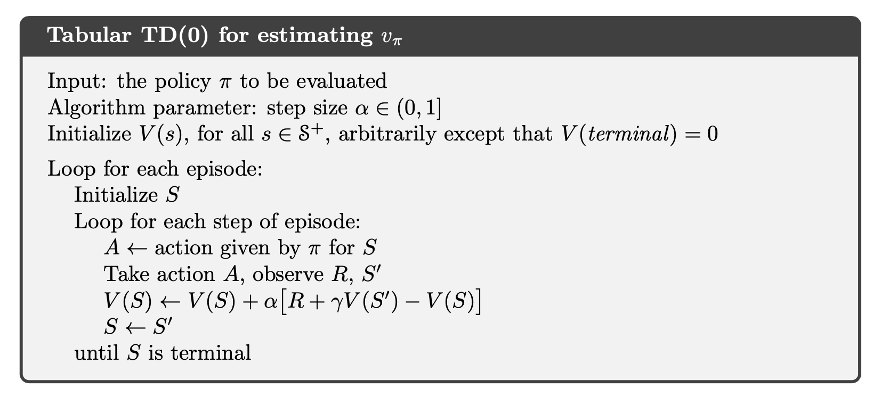
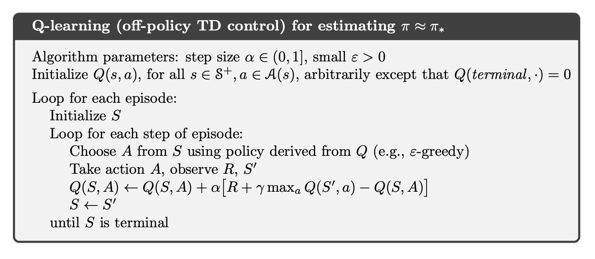

# **Temporal-Difference Learning**

- TD learning is a combination of **Monte Carlo** ideas and **dynamic programming** (DP) ideas. Like Monte Carlo methods, TD methods can **learn directly from raw experience** without a model of the environment’s dynamics. Like DP, TD methods update estimates based in part on other learned estimates, **without waiting for a final outcome** (they bootstrap).
    
    **Problem with MC Method**: 
    1. It may violate real-time performance and require us to run an **episode to termination**. 
    2. We are using the proper long-term average with it the assumption that our environment is **stationary**.
    
    - To remove the **requirement of stationary** to handle non-stationary environments:
        
        $$
        Q(S_{t},A_{t}) \leftarrow Q(S_{t},A_{t}) + \frac{1}{N(S_{t})}(G_{t}-Q(S_{t},A_{t}))\\ 
         Q(S_{t},A_{t}) \leftarrow Q(S_{t},A_{t}) + \alpha(G_{t}-Q(S_{t},A_{t}))
        $$
        
    - To remove the **need for episodic knowledge** (since we need to estimate return $G$ for value function by sampling reward time series $R_{i}$)
        
        $$
        Q(S_{t},A_{t}) \leftarrow Q(S_{t},A_{t}) + \alpha(R_{t+1}+\gamma Q(S_{t+1},A_{t+1})-Q(S_{t},A_{t}))\\ 
        $$
        
- **TD Prediction**
    
    For every-visit MC:
    
    $$
    V(S_{t})\leftarrow V(S_{t})+\alpha[G_{t}-V(S_{t})]
    $$
    
    For one-step TD:
    
    $$
    V(S_{t})\leftarrow V(S_{t})+\alpha[R_{t+1}+\gamma V(S_{t+1})-V(S_{t})]
    $$
    
    

    
- **Advantages of TD Methods**:
    - **Comparing to DP**: TD do not require a model of the environment, of its reward and next-state probability distributions.
    - **Comparing to MC**: TD methods are naturally implemented in an online, fully incremental fashion. Do not need to wait until the end of an episode, only need to wait one step. (Since Some applications have very long episodes, so that delaying all learning until the end of the episode is too slow. Other applications are continuing tasks and have no episodes at all.)
- **Explain how and why bootstrapping is employed.**

    How? V (S_t) ← V (S_t) + α [R_(t+1) + γV (S_(t+1) )− V (S_t )]
    With **DynProg Eval**, in order to obtain $v_{\pi}$, we approximated $v_{\pi}(S_{t+1})$ on the RHS via the use of $V_{\pi}(S_{t+1})$ (i.e., the contents of the tabular data structure that was being iterated); we called this **bootstrapping**. With **TD(0)**, we approximate the expected reward with a sampling of the reward and we bootstrap by employing the approximation $V_{\pi}(S_{t+1})$.
- **Eval Step and expected reward approximation**
    - With **DynProg Eval**, in order to obtain $v_{\pi}$, we approximated $v_{\pi}(S_{t+1})$ on the RHS via the use of $V_{\pi}(S_{t+1})$ (i.e., the contents of the tabular data structure that was being iterated); we called this **bootstrapping**.
    - With **MC Eval** we approximated the expected return with sample averages of the rewards
    - With **TD(0)**, we approximate the expected reward with a sampling of the reward and we bootstrap by employing the approximation $V_{\pi}(S_{t+1})$.
- **Explain how and why bootstrapping may be problematic.**

    The value function will have an initial value that is erroneous, and hence there will be a transient period where the BS'd value is high bias. We require time for the BS values to be meaningful.
- **If you had full access to a simulator for an environment of interest, how would you use this to address the problematic issues with BS.**

    If we had access to a simulator, we could run many episodes to obtain a very high quality value function that could be used to initialize the system. This would give us the benefits of a well-populated value function initially with more meaningful values. Exploratory starts would be used to give us the best possible value function. Then this would be the initial state for the value function, and we'd use TD methods.
- **On-policy TD Control**
    
    $$
    Q(S_{t},A_{t})\leftarrow Q(S_{t},A_{t})+\alpha[R_{t+1}+\gamma Q(S_{t+1},A_{t+1})-Q(S_{t},A_{t})]
    $$
    
    

    
    Initial the action-value function $Q(s,a)$. For each episode, initial the start state $S$ and choose initial action $A$ from $S$ based on the $Q$ using epsilon greedy. For each step, keep record the reward and next state, choose next action $A'$ from next state $S'$ based on the current $Q$, then update the $Q$ using $S, A, R, S', A'$. Loop until $S$  is terminal.
    
    **Recall:**
    
    - **for behavioral diversity**, we require $\pi$ to be soft
    - for **optimal behavor**, we require π to be greedy as $t \to \infin$
    
    This suggests that we make $\pi$ $\epsilon$ -greedy, and decrease $\epsilon$ with $t$; the text proposes putting $\epsilon$ on a time-based schedule, setting $\epsilon = \frac{1}{t}$ . With this, we have a guarantee that $\pi \to \pi_{*}$ in the limit.
    
- **Improve GPI with epsilon-greedy policies?**

    We can improve GPI with epsilon-greedy policies by making epsilon adaptive, e.g., gradually bring it lower as time passes, e.g. by having it inversely proportional to the number of iterations. This is equivalent to starting off with more exploration (to explore more of the state-action space) and then gradually leaning more towards exploitation (to focus on the learned optimal actions).
- **Q-Learning: Off-policy TD Control**
    
    $$
    Q(S_{t},A_{t})\leftarrow Q(S_{t},A_{t})+\alpha[R_{t+1}+\gamma \max_{a}Q(S_{t+1},a)-Q(S_{t},A_{t})]
    $$
    
    

    
    Recall that the off-policy Q-Learning and Expected SARSA from TD(0) **did not require importance sampling**
    
    In this case, the learned action-value function, $Q$, directly approximates $q_{*}$, the optimal action-value function, independent of the policy being followed.
    
    Q Learning augments the on-policy method of SARSA by incrementally updating Q in a manner consistent with what a **fanatically-optimal policy** would do and not based on what the **current policy** did. It is thus an off-policy method: **the policy generating the actions is not the basis for the update to Q**: the starting (St, At) pair comes from the current policy, the reward Rt and next state St come from the environment, and the next action At+1 comes from the optimal action per Q (not the current policy SARSA). The only role of the policy during Q learning is to ensure adequate sampling so that Q is effectively approximated. Once Q is approximated, one can determine the control policy from Q via the selection of the maximizing action.
    
- What is a **fanatically-optimal policy**?

    One that pursues the optimum via choosing the a that maximizes Q; ε-soft policies — even ε-greedy ones — are **not** fanatical, since they allow sub-optimality
- **Expected Sarsa**
    
    In Sarsa, we sample the S × A space with our policy, and update the estimate for Q, the estimate for Q(St, At) will tend to some expected value based on a probabilistic weighting per the policy; this evolution will occur, with fluctuations, over time. With Expected SARSA, rather than getting the Q to its expected value over time, we simply compute the expected value itself, and apply it to our update rule for Q.
    
    $$
    \begin{align}
    Q(S_{t},A_{t})&\leftarrow Q(S_{t},A_{t})+\alpha[R_{t+1}+\gamma \mathbb{E}_{\pi}[Q(S_{t+1},A_{t+1})|S_{t+1}]-Q(S_{t},A_{t})] \\
    &\leftarrow Q(S_{t},A_{t})+\alpha[R_{t+1}+\gamma\sum_{a}\pi(a|S_{t+1})Q(S_{t+1},a) -Q(S_{t},A_{t})] \\
    \end{align}
    $$
    
    

    
    More complex computationally, but can eliminate the variance due to random selection.
    
    For on-policy approach, Expected SARSA performs **better** than SARSA. For off-policy, when we choose $\pi$ to be the greedy policy, Expected SARSA is **equivalent to** Q Learning.

    