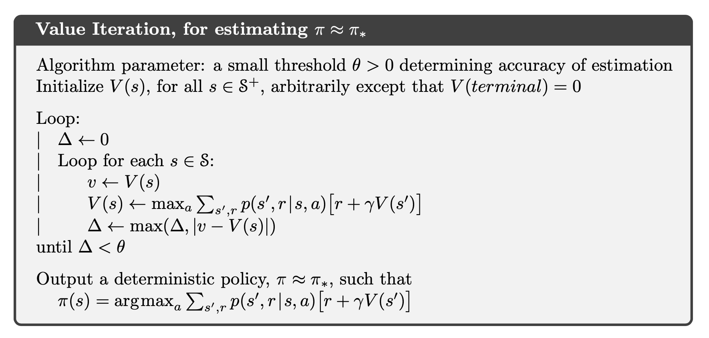
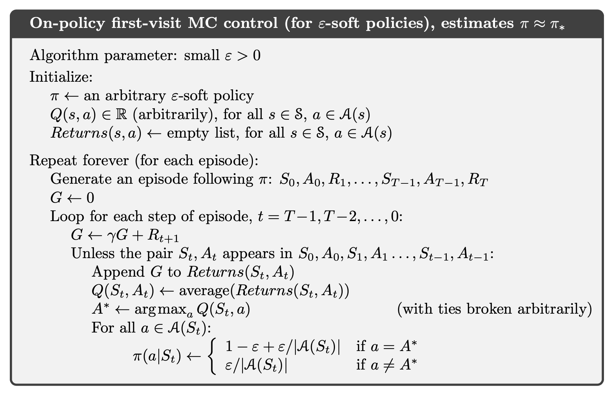

 
 
 

</a> 

 
     
       

# **Reinforcement Learning Overview**

- Projects and Study Notes about Reinforcement Learning
Based on [Sutton, R. S., Bach, F., &amp; Barto, A. G. (2018). Reinforcement learning: An introduction. MIT Press Ltd.](http://incompleteideas.net/book/the-book-2nd.html)

### **Introduction**

  
Click Here

 **What is Reinforcement Learning?**
Map situations to actions → Maximize a numerical reward signal
- **Reinforcement Learning System?**
Policy, Reward Signal, Value Function, Model of the Environment
    
    The formulation of the AI control problem: an agent, $M$, interacts with an environment, $E$, by dynamically issuing actions, $A_{t}$, based on environment state feedback, $S_{t}$, and environment reward $R_{t}$. The agent **selects actions** according to policy $\pi(A_{t},S_{t})$. The goal of the agent is to **maximize its return** $G_{t}$.
    
- **The trade-off between exploration and exploitation**
    - **Exploit** their instantaneous knowledge of the environment (already experienced)
    - Refine their knowledge of the environment by experience, which includes **Exploration** of the environment (to make better action selections)
- **Tunable or adjustable Data Structure for a Machine Learning system**
    - Tables of values (numbers) that are adjusted
    - Functions with adjustable coefficients (e.g., neural networks)
- **Machine Learning could be done online and offline**
    - Online Machine Learning system learns while the system is in operation (We are concerned)
    - Offline Machine Learning system has two modes of operation: training mode and production mode

> - $S_{t}$ : State at time $t$   - $A_{t}$: Action selected at time $t$   - $R_{t}$: Reward at time $t$
> 

$$S_{0},A_{0},R_{1},S_{1},A_{1},R_{2},S_{2},A_{2},R_{3},...$$

- **The environment information we have** → The probability of next state and reward given current state and action selected
    
    $$p(s',r|s,a)\doteq \mathrm{Pr}({S_{t}=s',R_{t}=r}|S_{t-1}=s,A_{t-1}=a)$$
    
    The probability that the next state is s’ and reward is r when we choose action a at state s.(Since when we choose action, the next state is not stable and will follow a distribution)
    
    We assume the environment is **state determined** (i.e., a Markov Decision Process)
    
- **Policy:** A mapping from states to probabilities of selecting each possible action.
    - $\pi(a|s)$ → Probability that $A_{t}=a$ if $S_{t} =s$
    
    The probability that the agent will pick action a at state s. (**Choose $A_{t}$ so that $G_{t}$ maximized**)
    
- **State-Value Function** for Policy $\pi$: Expected return when starting in $s$ and following $\pi$
    - $v_{\pi}(s) = E_{\pi}[G_{t}|S_{t}=s]=\sum_{a}\pi(a|s)\sum_{s',r}p(s',r|s,a)[r+\gamma v_{\pi}(s')]$
- **Action-Value Functio**n for Policy $\pi$: Value of taking action $a$ in state $s$ under policy $\pi$
    - $q_{\pi}(s,a) = E_{\pi}[G_{t}|S_{t}=s,A_{t}=a]= \sum_{s',r}p(s',r|s,a)[r+\gamma v_{\pi}(s')]$
    
    Note: We can get $q_{\pi}(s,a)$ using $v_{\pi}$
    
    
    
- $\gamma$ is a parameter, $0\leq\gamma\leq1$, called the ***discount rate.*** As $\gamma$ close to 0, the agent will try to maximize immediate rewards. As $\gamma$. close to 1, the agent will care more about the future reward.
    
    $$G_{t}\doteq R_{t+1}+\gamma R_{t+2}+\gamma^{2}R_{t+3}+...=\sum^{\infty}_{k=0}\gamma^{k}R_{t+k+1},$$
    
- **Optimal Policies** and **Optimal Value Functions**
    
    $$v_{*}(s)\doteq\max_{\pi}v_{\pi}(s), \mathrm{\ for \ all \ } s\in\mathcal{S}$$
    
    Pick the best policy pi which could produce the max output of state-value function.
    
    $$q_{*}(s,a)\doteq\max_{\pi}q_{\pi}(s,a), \mathrm{\ for \ all \ } s\in\mathcal{S}\mathrm{\ and\ } a \in \mathcal{A} $$
    
- **What do we need to directly use Bellman optimality equation to find optimal policy?**
    1. the dynamics of the environment are accurately known; 
    2. computational resources are sufficient to complete the calculation; 
    3. the states have the Markov property.
    
    So in practice, agent **rarely** learns an optimal policy.

### **Dynamic Programming**

  
Click Here

- We usually assume that the **environment is a finite MDP**. That is, we assume that its state, action, and reward sets, S, A, and R, are finite, and that its dynamics are given by a set of probabilities $p(s',r|s,a)$
- **DynProg** showed us that with a model of the **environment’s transition dynamics**, i.e., $p(s', r|s, a)$, we can solve the **prediction problem** via calculation to obtain $v_{\pi}$ and/or $q_{\pi}$ given $\pi(a|s)$. With the value functions, obtained above, we have the means to improve policy $\pi$: we can adjust policy $\pi$ such that:
    - (**via** $v_{\pi}$) for every state, $s$, modified policy $\pi'$ acts so $E$ evolves to state $s' = \arg\max_{s}(v_{\pi}(s))$, i.e., the state with the maximum value (note: in order to derive the action that allows this, **the agent will require** $p$)
    - (**via** $q_{\pi}$) for every state, $s$, modified policy $\pi'$ selects action $a=\arg\max_{a}q_{\pi}(s,a)$
- **Policy Evaluation (Prediction)**

Start by choosing arbitrarily v0 and keep update the Bellman equation until we reach the fixed point so that v == V(s).

**Policy evaluation (Eval)** (also called prediction): given a policy, $\pi$, obtain the associated value function (i.e., $v_{\pi}$ or $q_{\pi}(s,a)$)

- **Policy Improvement**
    
    $$
    \begin{align}
    \pi'(s)&\doteq \argmax_{a}q_{\pi}(s,a) \\
    &= \argmax_{a} \mathbb{E}[R_{t+1}+\gamma v_{\pi}(S_{t+1})|S_{t}=s, A_{t}=a] \\
    &= \argmax_{a}\sum_{s',r}p(s',r|s,a)[r+\gamma v_{\pi}(s')] \\
    \end{align}
    $$
    
    Selecting at each state the action that appears best according to $q_{\pi}(s,a)$ to make the new policy improves on original policy.
    
    **Policy improvement (Impr)**: given a policy, $\pi_{k}$, synthesize an improved policy, $\pi_{k+1}$, whose value function exceeds that of the $k$-th policy
    
- **Policy Iteration**

Do policy evaluation first using current policy $\pi_{k}$, then we can have the state-value function $V_{\pi_{k}}(s)$ based on $\pi_{k}$ which contains expected return for each state. After that we will do policy improvement based on the current state-value function $V_{\pi_{k}}(s)$.  We will pick the action that max the $q_{\pi_{k}}(s,a)$ in state s and update our current policy. The policy Iteration will stop when the policy is stable.

- **Value Iteration**
    
    $$
    \begin{align}
    v_{k+1}(s)&\doteq \max_{a} \mathbb{E}[R_{t+1}+\gamma v_{k}(S_{t+1})|S_{t}=s, A_{t}=a] \\
    &= \max_{a}\sum_{s',r}p(s',r|s,a)[r+\gamma v_{k}(s')] \\
    \end{align}
    $$
    
    
    
    Instead of doing policy evaluation and obtaining state-value function $V_{\pi_{k}}(s)$, we directly find the action a that maximizes the state-value function under state s. Then get the policy based on the stable state-value function.
    
- **What is Generalized policy iteration (GPI)?**
Although DP model allows one to compute the optimal policy, $\pi_{*}$, this **computation can be intractable** for large problems. Instead, we consider iterative approaches to solve for the optimal policy. **Generalized policy iteration (GPI)** can be referred to the general idea of letting policy-evaluation and policy-improvement processes interact. If both the evaluation process and the improvement process stabilize, that is, no longer produce changes, then the value function and policy must be optimal.
- **Why that Eval_Trunc could be used in place of Eval is important for Dynamic Programming?**
Policy Iteration interleaves Eval and Impr; however, the Eval step is itself an asymptotic process that requires iteration (n → ∞) to get to vpi or qpi. Eval- Trunc is a practical alternative that allows the use of an approximation Vpi or Qpi, which can be computed in T < ∞.
- **Why that Eval_Trunc could be used in place of Eval is important for Reinforcement Learning?**
This is vital to RL because it enables the use of any process in which the approximate V or Q is computed, e.g., Monte Carlo sampling.
- **Why we still need value iteration or EvalTrunc?**
    
    One major issue is **time complexity**: Eval is an asymptotic inner iteration of an asymptotic outer iteration (GPI). Of major significance is **value iteration**: the replacement of Eval by **truncated evaluation** (**EvalTrunc**) enabling us to profitably use approximations of the value functions in GPI.
    
    We note that the iterative sub-process for Eval, which converges to $v_{\pi}$ (or $q_{\pi}$) asympototically, **can be truncated** (i.e. to the approximations $V_{\pi}$ (or $Q_{\pi}$)
    
    DynProg’s value iteration — i.e., the relaxation of the need for $v_{\pi}$ , in favor of the approximation $V_{\pi}$ — leads us to Monte Carlo where, **instead of exploiting $p$ to calculate the value functions, we sample the environmental rewards to estimate the return**, and thereby the value functions.
    
- **Eval Step and expected reward approximation in DP, MC, and TD?**
    - With **DynProg Eval**, in order to obtain $v_{\pi}$, we approximated $v_{\pi}(S_{t+1})$ on the RHS via the use of $V_{\pi}(S_{t+1})$ (i.e., the contents of the tabular data structure that was being iterated); we called this **bootstrapping**.
    - With **MC Eval** we approximated the expected return with sample averages of the rewards
    - With **TD(0)**, we approximate the expected reward with a sampling of the reward and we bootstrap by employing the approximation $V_{\pi}(S_{t+1})$.
- **Why Bellman equation is important for Dynamic Programming?**
The Bellman equations define a relation that the optimal v∗ or q∗ must obey. This enables the use of an iterative process to compute the v or q; the fixed point of this dynamic process will necessarily satisfy the Bellman equations.
    - $v_{k+1}(s) =\sum_{a}\pi(a|s)\sum_{s',r}p(s',r|s,a)[r+\gamma v_{k}(s')]$
    - $q_{k+1}(s,a)= \sum_{s',r}p(s',r|s,a)[r+\gamma \sum_{a'}\pi(a'|s')q_{k}(s',a')]$

[Dynamic_Programming.ipynb](https://github.com/Followb1ind1y/Reinforcement_Learning/blob/main/Dynamic_Programming.ipynb)

### **Monte Carlo Methods**

  
Click Here

- We do **not** assume complete knowledge of the **environment**. Monte Carlo methods require only **experience.** We assume experience is divided into **episodes**, and that all episodes eventually terminate no matter what actions are selected.
- **MDP formulation with Bellman equation** allows us to calculate the optimal policy, $\pi_{*}$.
- We formulated an iterative process (**GPI**) for which the optimal policy is a fixed point.
- Instead of the asymptotic **Eval** that yields $v_{\pi}$, we settled on a practical truncation, **EvalTrunc**, that gives us the approximation $V_{\pi}$ and demonstrated that GPI still works. This means we can employ Monte Carlo to approximating the value function via **sampling and averaging rewards to estimate the returns**.

We only require that the environment obey the Markov property (i.e., it is state determined); we don’t requite the model itself.

Monte Carlo demands sampling in favor of analytic calculations; this requires **data** (i.e., **rewards**) and hence **experience.** Monte Carlo demands **effective sampling**, which pose **stochastic** requirements on our action selection

- **Explain how exploration concretely manifests itself in Reinforcement Learning as presented for Dynamic Programming and Monte Carlo methods.**
    - Exploration does not manifest itself in Dynamic Programming since DynProg is a calculation technique that exploits a model of the environment (p); it does not require sampling of the environment directly (and hence does not need exploration to ensure full sampling of the SxA domain of Q, or the S domain of V).
    - Exploration manifests itself in MC via the need to adequately sample the SxA domain space of Q; this is needed to ensure the Q table is as complete as possible (which in turn ensures that improvement is done with adequate information). Exploring starts is possible in simulated environments, in which we can “explore” the SxA space of the simulated environment. For real environments which can not be simulated, exploration is demanded of the policy to ensure GPI produces high-quality approximations of the value functions.
- **Why is exploration needed?**
Exploration is needed to ensure that the domain of the value function is fully sampled; this will ensure that the approximate value function is as complete as possible.
- **First Visit Monte Carlo Prediction**
    
    
    
    Given a policy $\pi$, we initial a state-value function $V(s)$ and a return. In the loop, we firstly generate an episode based on $\pi$. We loop back based on the episode we just generated and record the return G, stop until we find $S_{t}$. Then append the G to the return list and set the $V(s)$ to the average of the return list.
    
- **Why we use action values rather than state values in MC? (focus on $Q$ not on $V$)**
With a model, state values alone are sufficient to determine a policy; one simply looks ahead one step and chooses whichever action leads to the best combination of reward and next state. Without a model, however, state values alone are not sufficient. One must explicitly estimate the value of each action in order for the values to be useful in suggesting a policy. Thus, one of our primary goals for Monte Carlo methods is to estimate $q_{*}$.
- **Explain the two approaches for GPI with on-policy MC.**
The two main on-policy MC approaches are GPI with exploring starts and GPI with an epsilon greedy policy. The former ensures we sample the action value function by explicitly ensuring we have episodes that adequately cover the entire state-action space. The latter obtains achieves this adequate sampling by using a stochastic policy which will, in the limit as iterations approach infinity, cover the entire state-action space.
- **Problem: Some state-action pair may never be visited in MC? (Maintaining Exploration)**
    - **Option 1 (exploring starts):** specifying that the episodes start in a state–action pair, and that every pair has a nonzero probability of being selected as the start.
        
        When learning directly from actual interaction with an environment, it will **not** work well. It is practical, generally, only when we have access to a **simulator** that we can start at any arbitrary state-action pair
        
        The exploration does not happen after the initial step.
        
    - **Option 2 (stochastic policy):** We demand that our policy be stochastic and that $\forall s$, $\pi(a|s)>0$: we thus see the need for exploration.
- **If we have a simulated environment, which method should we choose?**
Exploring starts is more appropriate for a simulated environment since it is possible to configure the environment in arbitrary state-action configurations, meaning it is easier to guarantee that we start at any configuration. Further- more, GPI with an epsilon greedy policy will only yield an optimal policy among the space of all epsilon-greedy policies whereas GPI with exploring starts will always yield the optimal policy.
- **Monte Carlo Control**

- **Two assumptions of MC Methods?**
We made two unlikely assumptions to obtain this guarantee of convergence for the Monte Carlo method. One was that the episodes have **exploring starts**, and the other was that **policy evaluation could be done with an infinite number of episodes**.
- To remove the assumption that policy evaluation operates on an **infinite number of episodes**.
    1. Hold firm to the idea of approximating $q_{\pi_{k}}$ in each policy evaluation. (require far too many episodes to be useful in practice on any but the smallest problem)
    2. Give up trying to complete policy evaluation before returning to policy improvement (Value Iteration)

Initial policy $\pi$, action-value $Q(s,a)$ and return. For each loop, randomly select select the initial state-action pair so that all pairs have change to be selected. Then generate an episode and loop back from t = T-1. Record the reward to return and set the $Q(s,a)$ to the average of the returns. Find the action that maximizes the $Q(s,a)$ and update $\pi$.

- To avoid the unlikely assumption of exploring starts: **on-policy method**s and **off-policy methods**. **On-policy** methods attempt to evaluate or improve the policy that is used to make decisions, whereas off-policy methods evaluate or improve a policy different from that used to generate the data.
- **soft policy: $\pi(a|s) > 0$** for all $s \in S$ and all $a \in A(s)$. But gradually shifted closer and closer to a deterministic optimal policy.
- $**\epsilon$ -soft policy:** policies for which $\pi(a|s) \geq \frac{\epsilon}{|A(s)|}$  for all states and actions. (small $\epsilon >0$)
- $**\epsilon$ -greedy policy:** Most of the time they choose an action that has maximal estimated action value, but with probability $\epsilon$ they instead select an action at random. (**the greedy policies to have equal probabilities and the non-greedy policies to also have the rest of the probability mass**)
    
    Any epsilon greedy policy is guaranteed to be an epsilon soft one since it implicitly enforces every probability to be at least $\frac{\epsilon}{|A(s)|}$. But an epsilon soft policy is not guaranteed to be a epsilon greedy policy.
    
- **What differentiates e-soft and e-greedy action selection policies?**
    
    An epsilon soft policy only requires π(a|s) ≥ ε , a ∈ A(s) whereas an epsilon |A(s)| greedy policy requires the greedy policies to have equal probabilities and the nongreedy policies to also have the rest of the probability mass (each equal as well). Any epsilon greedy policy is guaranteed to be an epsilon soft one since it implicitly enforces every probability to be at least ε anyway. However, the |A(s)| other way around is not always true (e.g., part c).
    
- **On-policy first-visit MC Control**
    
    
    
    Different from the exploring start, on-policy method directly generate episodes and pick the action that maximizes the $Q(s,a)$. To update the $\pi(S_{t})$, we use epsilon greedy.
    
    The on-policy approach in the preceding section is actually a compromise—it learns action values not for the optimal policy, but for a near-optimal policy that still explores.
    
- **Why we need an off-policy method? (Conflict)** 
There is a fundamental conflict between Eval and GPI that we need to address. The goal of Eval is to estimate Q; Impr can then use Q to synthesize a better policy. The goal of GPI is to obtain the optimal policy, and to that end it interleaves Eval and Impr. However, an optimal policy must be fanatical in taking the best action; an effective Eval process must sample the domain space of Q adequately — this includes taking potential sub-optimal exploratory actions. It is not possible to interleave a process (Eval) that demands exploratory, diverse action selection policies, in a process whose goal it is to obtain a fanatically-optimal policy.
    
    The conflict can be resolved with off policy methods where the behavior- generating policy (b) is distinct from the agent control policy (π) that GPI is improving. We can then evaluate policy b (which will possible since b will be a policy that covers π, but is also sufficiently-diverse; e.g., it can be an ε-soft version of π) to obtain the value function of b. Via **importance sampling** we can convert the value function of b into one for π, enabling Impr for π.
    
- **Off-policy learning:** use two policies, one that is learned about and that becomes the optimal policy, and one that is more exploratory and is used to generate behavior. The policy being learned about is called the **target policy ($\pi$)**, and the policy used to generate behavior is called the **behavior policy ($b$)**.
    
    
    
- **How does off-policy works in MC prediction?**
    
    The outer loop starts with a policy b that covers policy π; recall, any ε-soft version of π will suffice (e.g., an ε-greedy πε). An episode is generated, and the initial return G is set to 0, and the initial importance sampling weight is set to W. We then compute the incremental return by working backwards in time; this makes the discounted-future return computation straightforward.
    

The key difference here is that as the prediction process runs (the inner loop’s Q update, per the above discussion), the **policy π** is also being updated. The **algorithm updates the policy immediately** upon obtaining an updated estimate of Q.

- **How are we able to estimate Q_pi using b as the episode-generating policy?**
Importance sampling allows us to scale the returns calculated from the rewards observed by following policy b. This allows us to approximate Q for the target policy π.
- **Why the prediction algorithm processes backwards? And what is the problem in off-policy control?**
    
    This introduces a **problem**: as we move backwards in time to process the episode (recall we earlier argued that the prediction algorithm processes backwards because it **enables the** **simple form of the incremental discounted return formula**) we run into the possibility that our **episode trace conflicts with the optimized policy**. Hence, we must do a check to confirm that the action is consistent with the updated greedy policy update. If it is: we can continue to use the episode to update Q. If it is not: we must break out of the loop, and regenerate a new episode.
    
- **Is there any ways to make an equivalent inner loop with a forward-time order?**
There is no way to make an equivalent inner loop with a forward-time order due to the possibility of exiting the loop if an observed action is ever different from the updated target policy action at the current time step. Therefore, the expected return may not be fully computed up until termination, meaning its estimate can be quite poor.
- **Why we compute the return using reversed time indices?**
If we processed the episode from the start and noticed an inconsistency, we would have to throw the estimated return, since we would not be able to get to the final reward RT. Processing backwards, our incremental return is always a valid estimate since it ends with the final return RT
- **In computing the returns, why does the iteration process episodes in reverse-time order?**
Processing the episode in reverse-time ensures we run the computation to the terminal state. This enables the simple computation of G using its recurrence relation.

[CartPole.ipynb](https://github.com/Followb1ind1y/Reinforcement_Learning/blob/main/CartPole.ipynb)

### **Temporal-Difference Learning**

  
Click Here

- TD learning is a combination of **Monte Carlo** ideas and **dynamic programming** (DP) ideas. Like Monte Carlo methods, TD methods can **learn directly from raw experience** without a model of the environment’s dynamics. Like DP, TD methods update estimates based in part on other learned estimates, **without waiting for a final outcome** (they bootstrap).
    
    **Problem with MC Method**: 
    1. It may violate real-time performance and require us to run an **episode to termination**. 
    2. We are using the proper long-term average with it the assumption that our environment is **stationary**.
    
    - To remove the **requirement of stationary** to handle non-stationary environments:
        
        $$
        Q(S_{t},A_{t}) \leftarrow Q(S_{t},A_{t}) + \frac{1}{N(S_{t})}(G_{t}-Q(S_{t},A_{t}))\\ 
         Q(S_{t},A_{t}) \leftarrow Q(S_{t},A_{t}) + \alpha(G_{t}-Q(S_{t},A_{t}))
        $$
        
    - To remove the **need for episodic knowledge** (since we need to estimate return $G$ for value function by sampling reward time series $R_{i}$)
        
        $$
        Q(S_{t},A_{t}) \leftarrow Q(S_{t},A_{t}) + \alpha(R_{t+1}+\gamma Q(S_{t+1},A_{t+1})-Q(S_{t},A_{t}))\\ 
        $$
        
- **TD Prediction**
    
    For every-visit MC:
    
    $$
    V(S_{t})\leftarrow V(S_{t})+\alpha[G_{t}-V(S_{t})]
    $$
    
    For one-step TD:
    
    $$
    V(S_{t})\leftarrow V(S_{t})+\alpha[R_{t+1}+\gamma V(S_{t+1})-V(S_{t})]
    $$
    
    
    
- **Advantages of TD Methods**:
    - **Comparing to DP**: TD do not require a model of the environment, of its reward and next-state probability distributions.
    - **Comparing to MC**: TD methods are naturally implemented in an online, fully incremental fashion. Do not need to wait until the end of an episode, only need to wait one step. (Since Some applications have very long episodes, so that delaying all learning until the end of the episode is too slow. Other applications are continuing tasks and have no episodes at all.)
- **Explain how and why bootstrapping is employed.**
How? V (S_t) ← V (S_t) + α [R_(t+1) + γV (S_(t+1) )− V (S_t )]
With **DynProg Eval**, in order to obtain $v_{\pi}$, we approximated $v_{\pi}(S_{t+1})$ on the RHS via the use of $V_{\pi}(S_{t+1})$ (i.e., the contents of the tabular data structure that was being iterated); we called this **bootstrapping**. With **TD(0)**, we approximate the expected reward with a sampling of the reward and we bootstrap by employing the approximation $V_{\pi}(S_{t+1})$.
- **Eval Step and expected reward approximation**
    - With **DynProg Eval**, in order to obtain $v_{\pi}$, we approximated $v_{\pi}(S_{t+1})$ on the RHS via the use of $V_{\pi}(S_{t+1})$ (i.e., the contents of the tabular data structure that was being iterated); we called this **bootstrapping**.
    - With **MC Eval** we approximated the expected return with sample averages of the rewards
    - With **TD(0)**, we approximate the expected reward with a sampling of the reward and we bootstrap by employing the approximation $V_{\pi}(S_{t+1})$.
- **Explain how and why bootstrapping may be problematic.**
The value function will have an initial value that is erroneous, and hence there will be a transient period where the BS'd value is high bias. We require time for the BS values to be meaningful.
- **If you had full access to a simulator for an environment of interest, how would you use this to address the problematic issues with BS.**
If we had access to a simulator, we could run many episodes to obtain a very high quality value function that could be used to initialize the system. This would give us the benefits of a well-populated value function initially with more meaningful values. Exploratory starts would be used to give us the best possible value function. Then this would be the initial state for the value function, and we'd use TD methods.
- **On-policy TD Control**
    
    $$
    Q(S_{t},A_{t})\leftarrow Q(S_{t},A_{t})+\alpha[R_{t+1}+\gamma Q(S_{t+1},A_{t+1})-Q(S_{t},A_{t})]
    $$
    
    
    
    Initial the action-value function $Q(s,a)$. For each episode, initial the start state $S$ and choose initial action $A$ from $S$ based on the $Q$ using epsilon greedy. For each step, keep record the reward and next state, choose next action $A'$ from next state $S'$ based on the current $Q$, then update the $Q$ using $S, A, R, S', A'$. Loop until $S$  is terminal.
    
    **Recall:**
    
    - **for behavioral diversity**, we require $\pi$ to be soft
    - for **optimal behavor**, we require π to be greedy as $t \to \infin$
    
    This suggests that we make $\pi$ $\epsilon$ -greedy, and decrease $\epsilon$ with $t$; the text proposes putting $\epsilon$ on a time-based schedule, setting $\epsilon = \frac{1}{t}$ . With this, we have a guarantee that $\pi \to \pi_{*}$ in the limit.
    
- **Improve GPI with epsilon-greedy policies?**
We can improve GPI with epsilon-greedy policies by making epsilon adaptive, e.g., gradually bring it lower as time passes, e.g. by having it inversely proportional to the number of iterations. This is equivalent to starting off with more exploration (to explore more of the state-action space) and then gradually leaning more towards exploitation (to focus on the learned optimal actions).
- **Q-Learning: Off-policy TD Control**
    
    $$
    Q(S_{t},A_{t})\leftarrow Q(S_{t},A_{t})+\alpha[R_{t+1}+\gamma \max_{a}Q(S_{t+1},a)-Q(S_{t},A_{t})]
    $$
    
    
    
    Recall that the off-policy Q-Learning and Expected SARSA from TD(0) **did not require importance sampling**
    
    In this case, the learned action-value function, $Q$, directly approximates $q_{*}$, the optimal action-value function, independent of the policy being followed.
    
    Q Learning augments the on-policy method of SARSA by incrementally updating Q in a manner consistent with what a **fanatically-optimal policy** would do and not based on what the **current policy** did. It is thus an off-policy method: **the policy generating the actions is not the basis for the update to Q**: the starting (St, At) pair comes from the current policy, the reward Rt and next state St come from the environment, and the next action At+1 comes from the optimal action per Q (not the current policy SARSA). The only role of the policy during Q learning is to ensure adequate sampling so that Q is effectively approximated. Once Q is approximated, one can determine the control policy from Q via the selection of the maximizing action.
    
    - What is a **fanatically-optimal policy**? 
    One that pursues the optimum via choosing the a that maximizes Q; ε-soft policies — even ε-greedy ones — are **not** fanatical, since they allow sub-optimality
- **Expected Sarsa**
    
    In Sarsa, we sample the S × A space with our policy, and update the estimate for Q, the estimate for Q(St, At) will tend to some expected value based on a probabilistic weighting per the policy; this evolution will occur, with fluctuations, over time. With Expected SARSA, rather than getting the Q to its expected value over time, we simply compute the expected value itself, and apply it to our update rule for Q.
    
    $$
    \begin{align}
    Q(S_{t},A_{t})&\leftarrow Q(S_{t},A_{t})+\alpha[R_{t+1}+\gamma \mathbb{E}_{\pi}[Q(S_{t+1},A_{t+1})|S_{t+1}]-Q(S_{t},A_{t})] \\
    &\leftarrow Q(S_{t},A_{t})+\alpha[R_{t+1}+\gamma\sum_{a}\pi(a|S_{t+1})Q(S_{t+1},a) -Q(S_{t},A_{t})] \\
    \end{align}
    $$
    
    
    
    More complex computationally, but can eliminate the variance due to random selection.
    
    For on-policy approach, Expected SARSA performs **better** than SARSA. For off-policy, when we choose $\pi$ to be the greedy policy, Expected SARSA is **equivalent to** Q Learning.

    

### **TD(n)**

  
Click Here

- **n-step TD Prediction**
    
    For **MC method**:
    
    $$
    G_{t}=R_{t+1}+\gamma R_{t+2}+ \gamma^{2} R_{t+3}+ \dots + \gamma^{T-t-1} R_{T}
    $$
    
    For **One-step Return**:
    
    $$
    G_{t:t+1}=R_{t+1}+\gamma V_{t}(S_{t+1})
    $$
    
    For **Two-step Return**:
    
    $$
    G_{t:t+2}=R_{t+1}+\gamma R_{t+2}+\gamma^{2} V_{t+1}(S_{t+2})
    $$
    
    For **One-step Return**:
    
    $$
    G_{t:t+n}=R_{t+1}+\gamma R_{t+2}+\dots +\gamma^{n-1}R_{t+n}+\gamma^{n} V_{t+n-1}(S_{t+n})
    $$
    
    
    
- **n-step SARSA**
    
    $$
    G_{t:t+n}=R_{t+1}+\gamma R_{t+2}+\dots +\gamma^{n-1}R_{t+n}+\gamma^{n} Q_{t+n-1}(S_{t+n},A_{t+n})
    $$
    
    $$
    Q_{t+n}(S_{t},A_{t})=Q_{t+n-1}(S_{t},A_{t})+\alpha[G_{t:t+n}-Q_{t+n-1}(S_{t},A_{t})]
    $$
    
    
    
    **Expected SARSA**:
    
    $$
    G_{t:t+n}=R_{t+1}+\gamma R_{t+2}+\dots +\gamma^{n-1}R_{t+n}+\gamma^{n} \bar{V}_{t+n-1}^(S_{t+n})
    $$
    
    where $\bar{V}_{t}(S)$ is the expected approximate value of state $s$
    
    $$
    \bar{V}_{t}(s)=\sum_{a}\pi(a|s)Q_{t}(s,a)
    $$
    
- **n-step Off-policy Learning**
    
    
    
    Recall that in order to use policy b for behavioral diversity, which improving policy $\pi$ for control, we require the important sampling ratio $\rho_{t+1:t+n}$.
    
- **Off-policy Learning Without Importance Sampling: The n-step Tree Backup Algorithm**
    
    
    
    Our **goal** is to compute $G_{t:t+n}$ **without relying on importance sampling**.
    
- **Sensitivity to the initial conditions of the value function? (In ascending order: begins with the least or smallest and ends with the greatest or largest)**
DP/MC, TD(n), TD(0)
- **Latency?**
DP, TD(0), TD(n), MC
- **Have access to an environment simulator run-time for MC?**
We could use a GPI on-policy method MC here. With an environment simulator run-time we could sample from the environment and get state-action pairs with exploring starts since it is possible to get the environment and get all state-action pairs. GPI with exploring starts will always get the optimal policy. We will initial pi and Q and return and keep generating episode then update value functions and Q to get optimal answers.
- **If you have access to the simulator's source code for MC?**
Can use exploring starts
- **If you do not have access to the simulator in advance for MC?**
Would need to use real experience instead of simulated
- **Have access to an environment simulator run-time for DP?**
Can estimate transition probabilities by using simulator.
- **If you have access to the simulator's source code for DP?**
Can directly access transition probabilities

  

[TD(n)_and_Mountain_Car.ipynb](https://github.com/Followb1ind1y/Reinforcement_Learning/blob/main/TD(n)_and_Mountain_Car.ipynb)

### **Function Approximation**

  
Click Here

- **Why do we need function approximation?**
Tabular methods store this knowledge in a table data structure with a size of order $|S| × |A|$ ($|S|$ and $|A|$ denote the sizes of the state space and action spaces, respectively). This is clearly only practical for **moderately-sized** state and action spaces. There are generally three means of representing functions:
    - **Tables of values** (Do not scale)
    - **Analytic expressions** (if we truly had such analytic expressions, there are probably **better** methods of solving our control problem than RL. e.g., control theory, or classical computer science)
    - **Function approximations** (parameterized functions tuned via gradient descent method)
- **Adaptive Functions**
Let $P$ be some phenomenon of interest in the real world, that takes some input and produces an output. Suppose we do not know what $F$ is. Instead we have a data set of input/output pairs experimentally sampled from $P$:
    
    $$
    DS= {(x^{(i)},t^{(i)})}^{N}_{i=1}
    $$
    
    In supervised learning, $x^{(i)}$ is termed the “data”, $t^{(i)}$ is the target. We wish to approximate the unknown $f$ with an approximation $\hat{f}$ so we can make predictions. We will propose that $\hat{f}$ is some parameterized function, $\hat{f}_{\theta}$ , that can map $D$ to $R$. Our problem is now to find the parameter $\theta_{*}$ such that:
    
    $$
    \hat{f}_{\theta^{*}}: x^{(i)}\to y^{(i)}\approx t^{(i)}
    $$
    
    We can measure the **per-prediction error** (i.e., the error of our prediction of the $i$-th target) via the **squared-error function**:
    
    $$
    PE = \frac{1}{2}(y^{(i)}-t^{(i)})^{2}
    $$
    
    With this we can also assess the **aggregate error** of our predictions over the entire dataset by averaging:
    
    $$
    E = \frac{1}{N}\sum_{\forall i}PE_{i} = \frac{1}{N}\sum_{\forall i}\frac{1}{2}(\hat{f}_{\theta}(x^{(i)})-t^{(i)})^{2}
    $$
    
    The aggregate error, $E$, is parameterized only by $\theta$ since all other components in this expression are constants. Thus $E(\theta)$ defines a **hyper-surface over the space of $\theta$ parameters**. This hyper-surface shows the prediction error for each choice of $\theta$ — our problem is now to traverse this performance hyper-surface to **find the minimum error** setting for $\theta$.
    
- **Gradient Descent**
Gradient descent is based on the simple idea that we can start from an arbitrary $\theta=\theta_{0}$ and update our estimates in the direction that descends the gradient (”slope”) of $E_{\theta}$. Thus algorithm can be used to search the performance surface for a **local minimum**. This is the gradient descent algorithm, which can be **used to tune a parameterized function** to fit a **general dataset**.
    
    
    
    - $\alpha>0$ controlling the rate of update on $\theta$. (Setting the α **too high** may cause **instability or oscillation**, while setting α **too low** may **impact the time** to converge)
    - $k_{E}$ sets the threshold on the acceptable aggregate error on our predictor
    - $k_{\nabla}$ sets the threshold on our acceptable criterion for “flatness”.
    
    **Problems with Gradient Descent:**
    
    - Does this mean that we can provide any parameterized function and be assured of getting an appropriate parameterization (i.e. $\theta$)?
    **NO**! **We must have sufficient degrees-of-freedom (i.e., dimensions of $\theta$) to fit a dataset.**
    - Is there a means of computing the acceptable dimensions for $\theta$ (i.e. the degrees of freedom, DOFs)
    **NO! This is called a hyper-parameter, and is set, open-loop, by the engineer.**
    - Is there a guaranty that once the DOFs (i.e., the dimensions of $\theta$) is set, we will get the global optimum?
    **No! There is no guaranty of a global optimum existing, and if we hit a minimum, it may be a local one whose location is sensitive to the initial condition, $\theta_{0}$.**
- **Stochastic Gradient Descent**
For problems with **very large datasets**, repeated computation of $E$ with the full data set is often impractical. To address this, stochastic gradient descent is used where we, for each iteration, **select a random subset of the dataset** to employ in the computation of $E$. The size of this subset can be decreased right down to using singleton elements of the dataset, randomly selected. This will impact the convergence time, but will will be usable.
- **Parameterized Functions**
    - The elementary parameterized function is the **adaptive linear combiner (ALC)** of linear regression:
        
        $$
        \hat{f} :x \to w^{T}x+b
        $$
        
    - General functions are not linear and so will require more expressiveness than the adaptive linear combiner model. Fortunately there is a simple means of transforming linear regression to enable **polynomial (nonlinear) regression**. We can construct a **feature mapping function**, $\phi$, that transforms $x$ to $\phi(x)$.
        
        
        
        The **advantages** of this technique is that, if we can identify an appropriate $\phi$, the nonlinear regression problem is merely a **standard application of linear regression** on $\phi(x)$.
        
    - If we can not identify an appropriate $\phi$ — and recall, there are **infinite $\phi$ available** — then we require a technique to which we can resort. The **neural network** is this general technique. We can add a **nonlinearity** $\sigma$ to the ALC’s output as follows:
        
        $$
        z_{1} = w_{1}^{T}x+b \\h_{1}=\sigma(z_{1})
        $$
        
        If $\sigma$ is **differentiable**, then we can compute the gradient as per the requirement of gradient descent, and use this as our object for nonlinear function approximation.

[Function_Approx_and_SARSA.ipynb](https://github.com/Followb1ind1y/Reinforcement_Learning/blob/main/Function_Approx_and_SARSA.ipynb)
        

### **Prediction and Control with Function Approximation**

  
Click Here

- We begin our study of function approximation in reinforcement learning by considering its use in estimating the state-value function from on-policy data, that is, in **approximating $v_{\pi}$ from** experience generated using a known policy $\pi$. We will write $\hat{v}(s,w) \approx v_{\pi}(s)$ for the approximate value of state s given weight vector $w$. For example, $\hat{v}$ might be a **linear function** in features of the state, with $w$ the vector of feature weights. More generally, $\hat{v}$ might be the function computed by a **multi-layer artificial neural network**, with $w$ the vector of connection weights in all the layers.
    
    $$
    w_{t+1} = w_{t}-\frac{1}{2}\alpha\nabla[v_{\pi}(S_{t})-\hat{v}(S_{t},w_{t})]^{2}\\ = w_{t}+\alpha\nabla[v_{\pi}(S_{t})-\hat{v}(S_{t},w_{t})]\nabla\hat{v}(S_{t},w_{t})
    $$
    

**Note**: Remember our essential goal is to **replace the tabular data structure** with a more scalable alternative. Our goal now is to also approximate $v_{\pi}$ or $q_{\pi}$ , as $\hat{v}$ or $\hat{q}$ using function approximation techniques.

**Problem:** We need a dataset! Specifically, in order to use the gradient descent-based supervised learning methods presented prior, we require sample input/output (data/target) tuples from $v_{\pi}$ or $q_{\pi}$.

- **Error Function**
Per our prior development, the per-prediction error is:
    
    $$
    PE(s) = \frac{1}{2}(\hat{v}(s)-v_{ref}(s))^{2}
    $$
    
    where, **ideally, $v_{ref}(s)=v_{\pi}(s)$**. Aggregating this over all states:
    
    $$
    E = \frac{1}{N}\sum_{\forall s\in S}PE_{i}(s)
    $$
    
    To this standard development, the textbook introduces a **per-state weighting function** $\mu(s)$ such that:
    
    $$
    \sum_{\forall s}\mu(s) = 1
    $$
    
    which serves to bias the tuning in favor of certain states (as per the distribution of $\mu(s)$; if $\mu(s)$ is identical for all states, then the development is essentially identical to the standard development.) It then defines the **aggregate of the weighted per-prediction errors** as:
    
    $$
    \bar{VE}=\frac{1}{N}\sum_{s\in S}\mu(s)PE(s)
    $$
    
    $\bar{VE}$ **is used in place of $E$ for gradient descent.**
    
- **Reference**
Setting $v_{ref}$ depends on whether we are using MC methods or TD ones. Al- though TD subsumes MC, there is a **key difference**: MC methods involve **no bootstrapping**, while TD does.
    - We perform **MC**, as usual, and compute our estimate of the reference by processing episodic content to arrive at $G_{t}$. This becomes the reference sample that will be used for $v_{ref}$ . We continue to stochastically sample returns, and apply this to the training process as our $v_{ref}$ yielding the update law:
        
        $$
        w \leftarrow w - \alpha[\hat{v}_{w}(S_{t})-G_{t}]\nabla_{w}\hat{v}_{w}(S_{t})
        $$
        
        
        
    - With **TD(0)**, approximate the reference as $R_{t} + \gamma V (S_{t+1})$. This involves **bootstrapping**, and it happens to **bias** the reference. For this reason, this is called a **semi-gradient** technique. The update law is as expected:
        
        $$
        w \leftarrow w - \alpha[\hat{v}_{w}(S_{t})-(R_{t} + \gamma V (S_{t+1}))]\nabla_{w}\hat{v}_{w}(S_{t})
        $$
        
        
        
        
        
        - **Why TD method involves bootstrapping, and it happens to bias the reference?**
        Bootstrapping targets such as n-step returns or the DP target all depend on the current value of the weight vector $w_{t}$, which implies that they will be **biased** and that they will not produce a true gradient-descent method. Bootstrapping methods are not in fact instances of true gradient descent. They take into account the effect of changing the weight vector $w_{t}$ on the estimate, but ignore its effect on the target. They include only a part of the gradient and, accordingly, we call them **semi-gradient methods**.
        - **Why we still need semi-gradient methods?**
        They do converge reliably in important cases. They typically enable significantly faster learning. They enable learning to be **continual and online**, without waiting for the end of an episode.
- **Episodic Semi-gradient Control**
    - The general gradient-descent update for action-value ****prediction is:
        
        $$
        w_{t+1} = w_{t}+\alpha[U_{t}-\hat{q}(S_{t},A_{t},w_{t})]\nabla\hat{q}(S_{t},A_{t},w_{t})
        $$
        
    - For example, the update for the **one-step Sarsa** method is
        
        $$
        w_{t+1} = w_{t}+\alpha[R_{t+1}+\gamma \hat{q}(S_{t+1},A_{t+1},w_{t})-\hat{q}(S_{t},A_{t},w_{t})]\nabla\hat{q}(S_{t},A_{t},w_{t})
        $$
        
        We call this method **episodic semi-gradient one-step Sarsa**.
        
        
        
- **Semi-gradient n-step Sarsa**
We can obtain an n-step version of episodic semi-gradient Sarsa by using an n-step return as the update target in the semi-gradient Sarsa update equation. The n-step return immediately generalizes from its tabular form to a function approximation form. The **n-step update equation** is
    
    $$
    w_{t+n} = w_{t+n-1}+\alpha[G_{t:t+n}-\hat{q}(S_{t},A_{t},w_{t+n-1})]\nabla\hat{q}(S_{t},A_{t},w_{t+n-1})
    $$
    
    

    

### **Policy Gradient**

  
Click Here

We consider methods that instead **learn a parameterized policy** that can **select actions without consulting a value function**. A value function may still be used to learn the policy parameter, but is not required for action selection. We write $\pi(a|s,\theta)=Pr\{A_{t}=a|S_{t}=s,\theta_{t}=\theta\}$ for the probability that action $a$ is taken at time $t$ given that the environment is in state $s$ at time $t$ with parameter $\theta$.

The idea behind policy gradient methods is simple at a high level: we represent the policy as a tunable function, and tune the parameters of the policy to optimize some metric, such that the resulting tuned policy exhibits the requisite competance (performance). We will use gradient traversal methods, and hence the gradient of the function approximation for the policy — the policy gradient — is the object of interest, as it is the basis for policy function tuning.

we consider methods for learning the policy parameter based on the gradient of some scalar performance measure $J(\theta)$ with respect to the policy parameter. These methods seek to maximize performance, so their updates approximate gradient ascent in $J$:

$$
\theta_{t+1}= \theta_{t}+\alpha\nabla\hat{J}(\theta_{t})
$$

Where $\nabla\hat{J}(\theta_{t})$ is a stochastic estimate whose expectation approximates the gradient of the performance measure with respect to its argument $\theta_{t}$. All methods that follow this general schema we call **policy gradient methods**, whether or not they also learn an approximate value function.

In policy gradient methods, the policy can be parameterized in any way, as long as $\pi(a|s,\theta)$ is differentiable with respect to its parameters. If the action space is **discrete and not too large**, then a natural and common kind of parameterization is to form parameterized numerical preferences $h(s,a,\theta)$ for each state–action pair. The actions with the highest preferences in each state are given the highest probabilities of being selected, for example, according to an exponential soft-max distribution:

$$
\pi(a|s,\theta)=\frac{e^{h(s,a,\theta)}}{\sum_{b}e^{h(s,b,\theta)}}
$$

We call this kind of policy parameterization **soft-max in action preferences**.

- Soft-max converts a set of discrete values into a soft metric in $(0, 1)$. This soft metric has similar properties to a stochastic value function, which has **ideal characteristics** including:
    - it admits stochastic action selection to facilitate exploration
    - it enables the realization of stochastic action selection where warrented
    - action selection probabilities vary smoothly with the function parameter (versus the hard selection from ε-greedy action selection)
- **Practical Advantage of parameterizing policies**
    - One advantage of parameterizing policies according to the soft-max in action preferences is that the approximate policy can approach a deterministic policy.
    - A second advantage of parameterizing policies according to the soft-max in action preferences is that it enables the selection of actions with arbitrary probabilities.
    - Perhaps the simplest advantage that policy parameterization may have over action- value parameterization is that the policy may be a simpler function to approximate.
    - We note that the choice of policy parameterization is sometimes a good way of injecting prior knowledge about the desired form of the policy into the reinforcement learning system.
- **Theoretical Advantage of parameterizing policies**
With continuous policy parameterization the action probabilities change smoothly as a function of the learned parameter, whereas in "$\epsilon$-greedy selection the action probabilities may change dramatically for an arbitrarily small change in the estimated action values. Largely because of this, **stronger convergence guarantees** are available for policy-gradient methods than for action-value methods.
- We simplify the notation without losing any meaningful generality by assuming that every episode starts in some particular (non-random) state $s_{0}$. Then, in the episodic case we define performance as
    
    $$
    J(\theta)=v_{\pi_{\theta}}(s_{0})
    $$
    
    where $v_{\pi_{\theta}}$ is the true value function for $\pi_{\theta}$, the policy determined by $\theta$.
    
- **How can we estimate the performance gradient with respect to the policy parameter when the gradient depends on the unknown effect of policy changes on the state distribution?
**There is an excellent theoretical answer to this challenge in the form of the **policy gradient theorem**, which provides an analytic expression for the gradient of performance with respect to the policy parameter that does not involve the derivative of the state distribution. The policy gradient theorem for the episodic case establishes that
    
    $$
    \nabla J(\theta)\propto \sum_{s}\mu(s)\sum_{a}q_{\pi}(s,a)\nabla \pi(a|s,\theta)
    $$
    
    
    
    
    
- **REINFORCE: Monte Carlo Policy Gradient**
The policy gradient theorem gives an exact expression proportional to the gradient; all that is needed is some way of sampling whose expectation equals or approximates this expression. Notice that the right-hand side of the policy gradient theorem is a sum over states weighted by how often the states occur under the target policy $\pi$; if $\pi$ is followed, then states will be encountered in these proportions. Thus
    
    $$
    \nabla J(\theta)\propto \sum_{s}\mu(s)\sum_{a}q_{\pi}(s,a)\nabla \pi(a|s,\theta) \\
    =E_{\pi}[\sum_{a}q_{\pi}(S_{t},a)\nabla\pi(a|S_{t},\theta)]
    $$
    
    We could stop here and instantiate our stochastic gradient-ascent algorithm as
    
    $$
    \theta_{t+1}=\theta_{t}+\alpha\sum_{a}\hat{q}(S_{t},a,w)\nabla\pi(a|S_{t},\theta)
    $$
    
    We then replace a sum over the random variable’s possible values by an expectation under $\pi$, and then sampling the expectation. We introduce a **weighting**, without changing the equality, by multiplying and then dividing the summed terms by $\pi(a|S_{t},\theta)$. We have,
    
    
    
    The final expression in brackets is exactly what is needed, a quantity that can be sampled on each time step whose expectation is proportional to the gradient. Using this sample to instantiate our generic stochastic gradient ascent algorithm yields the REINFORCE update:
    
    $$
    \theta_{t+1}= \theta_{t}+\alpha G_{t}\frac{\nabla\pi(A_{t}|S_{t},\theta_{t})}{\pi(A_{t}|S_{t},\theta_{t})}
    $$
    
    Note that REINFORCE uses the complete return from time $t$, which includes all future rewards up until the end of the episode. In this sense REINFORCE is a **Monte Carlo algorithm** and is well defined only for the episodic case with all updates made in retrospect after the episode is completed.
    
    

    

### **Planning**

  
Click Here

By a model of the environment we mean anything that an agent can use to predict how the environment will respond to its actions. Given a state and an action, a model produces a prediction of the resultant next state and next reward. If the model is stochastic, then there are several possible next states and next rewards, each with some probability of occurring. Some models produce a description of all possibilities and their probabilities; these we call **distribution models**. Other models produce just one of the possibilities, sampled according to the probabilities; these we call **sample models**. **Distribution models are stronger** than sample models in that they can always be used to produce samples. However, in many applications it is much **easier to obtain sample models** than distribution models.

We say the model is used to simulate the environment and produce simulated experience. The word **planning** is used in several different ways in different fields. We use the term to refer to any computational process that **takes a model as input** and produces or **improves a policy** for interacting with the modeled environment:

There are two basic ideas: (1) all state-space planning methods involve **computing value functions** as a key intermediate step toward improving the policy, and (2) they compute value functions by updates or backup operations applied to **simulated experience**. This common structure can be diagrammed as follows:

The heart of both **learning** and **planning** methods is the estimation of value functions by backing-up update operations. The difference is that whereas planning uses **simulated experience** generated by a model, learning methods use **real experience** generated by the environment.

**The benefits of planning** in small, incremental steps. This enables planning to be **interrupted or redirected at any time** with little wasted computation, which appears to be a key requirement for efficiently intermixing planning with acting and with learning of the model. Planning in very small steps may be the most efficient approach even on pure planning problems if the **problem is too large** to be solved exactly.

Within a planning agent, there are at least two roles for **real experience**: it can be used to **improve the model** (to make it more accurately match the real environment) and it can be used to **directly improve the value function** and policy using the kinds of reinforcement learning methods. The former we call **model-learning**, and the latter we call **direct reinforcement learning** (direct RL).

Both direct and indirect methods have **advantages** and **disadvantages**. Indirect methods often make fuller use of a limited amount of experience and thus achieve a better policy with fewer environmental interactions. On the other hand, direct methods are much **simpler** and are **not affected by biases** in the design of the model.

- **MC Tree Search**
    
    

